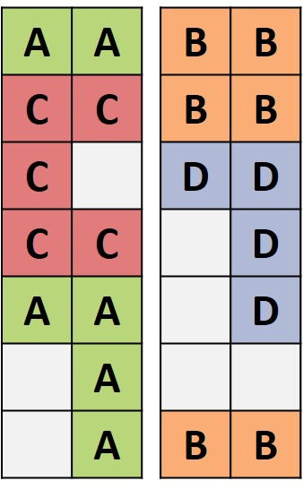
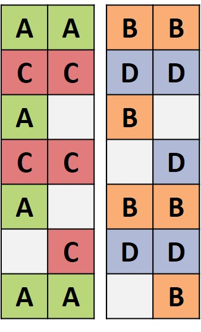
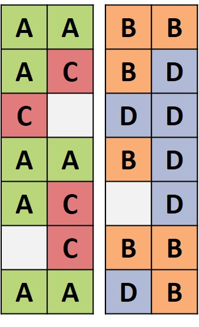
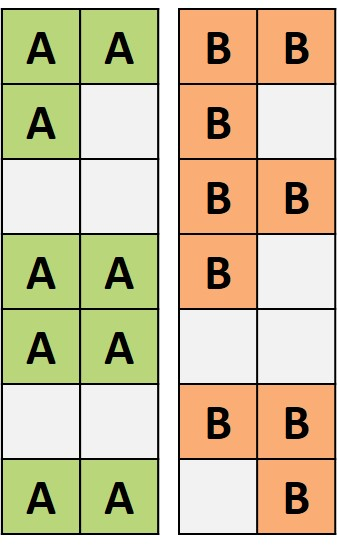
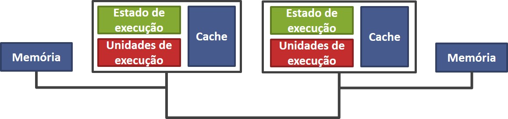
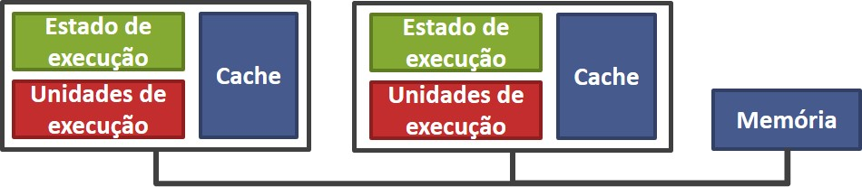
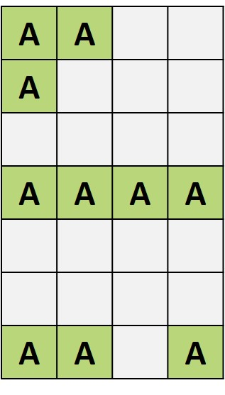
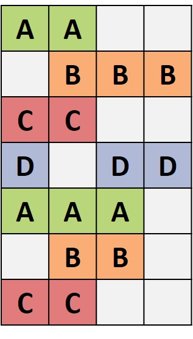

# Organização e Arquitetura de Computadores

## Multicore
#### Blocked Multithreading

#### Interleaved Multithreading

#### Simultaneous Multithreading

#### Superescalar

## Multiprocessador
#### Numa

#### Uma

## Superscalar
#### Superscalar

#### Multithread

