# Linguagem de Montagem e de Máquina

## Introdução a instruções 
Para controlar o HW de um computador é preciso falar sua linguagem. As palavras da linguagem de um computador são chamadas de instruções e seu vocabulário é denominado de conjunto de instruções (ISA - arquitetura do conjunto de instruções).

Exemplo de conjunto de instruções:

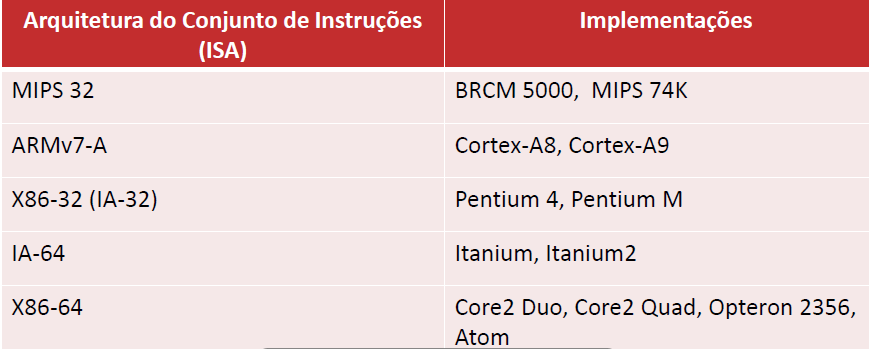

- Uma aplicação típica pode possuir: 
  - Milhares/milhões de linhas de código 
  - Dependência de bibliotecas sofisticadas (conjunto de instruções) 
- Hardware do computador executa apenas instruções muito simples 
- A tradução de uma aplicação complexa para instruções simples depende de diversas camadas de software. Esse é o princípio de abstração  
- Para conversar com o hardware, é preciso enviar sinais elétricos: 
  - Alfabeto do hardware tem 2 símbolos 0 e 1 
  - Hardware trabalha com bits 

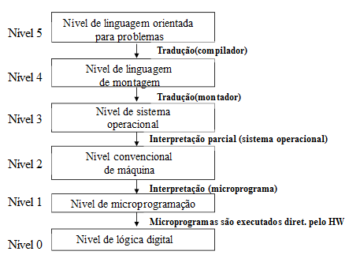

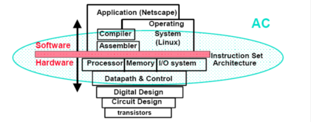
<br/>
<br/>
<br/>

<br/>
<br/>
<br/>


## Linguagem de máquina 
- É a linguagem mais primitiva de um computador 
- Instruções são passadas para o hardware através de sequências de bits 
- Cada família de computadores possui sua própria linguagem de máquina 
- A linguagem de máquina entendida por um processador é definida por sua ISA (Instruction Set Architecture). 
- Dois computadores com a mesma ISA não tem necessariamente a mesma implementação/organização de hardware. 

Exemplo) 

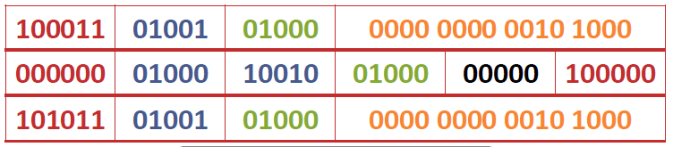
<br/>
<br/>
<br/>

## Linguagem de montagem 
Em algumas situações é necessário utilizar a linguagem de montagem como por exemplo: 
- Quando tamanho do programa / velocidade é crítico - Alguns sistemas embarcados por exemplo 
- Compilador não está disponível - Sistemas antigos 
- Exemplos de linguagem de montagem:  Bytecode do JAVA,  Assembly 

### Vantagens 
- O programador controla melhor os recursos de hardware. 

### Desvantagens 
- Código não portável 
- Programas mais longos 
- Menor produtividade 
- Menor legibilidade 

### ISA da disciplina: assembly MIPS-32 (Microprocessor without Interlocked Pipeline Stages) 
Escolhida pela simplicidade. 

Características: 
- Possui 32 registradores 
  - A: argumentos 
  - T: temporários 
  - S: temporários salvos (variáveis) 

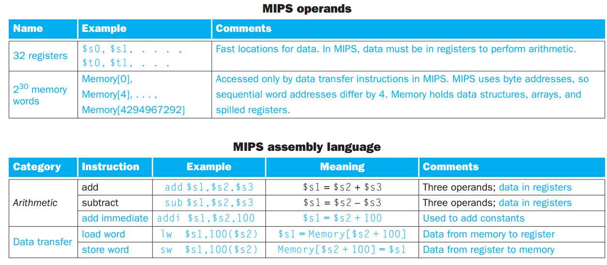

- Cada instrução do MIPS realiza somente 1 operação 
- Cada instrução exige 3 operandos. Isso faz com que o HW mantenha a simplicidade e ilustra o 1 princípio:
<br/>
<br/>
<br/>

## **Princípios de Projeto** 

### Princípio de Projeto: **A simplicidade favorece a regularidade** 
- MIPS: arquitetura RISC (Reduced Instruction Set Computer)
- O registrador na arquitetura MIPS tem 32 bits 
- Um registrador também é chamado de Word (palavra) 
- Tem somente 32  registradores para manter a simplicidade, pois uma quantidade muito grande de registradores pode aumentar o tempo de clock porque os sinais eletronicos levam mais tempo quando precisam atravessar uma distância maior. 

### Princípio de Projeto: **Menor significa mais rápido**
- Número ilimitado de variáveis em software 
- Número limitado de registradores: nem todas variáveis podem estar em registradores simultaneamente. 
- Necessário alocar registradores para variáveis: 
  - manual: programação em assembly :~ 
  - automática: compilador :D 

#### Registradores VS memória 
- Mem: Acesso mais lento, bilhões de elementos 
- Reg: Acesso mais rápido, dezenas de elementos 
- Boa alocação leva a melhor desempenho e consumo. Para isso o compilador tenta mantes as variáveis mais frequentes nos registradores e coloca o restante na memória. O processo de colocar variáveis menos utilizadas na memória é chamado de registradores derramados (spilled registers). 

Exemplo: `x = A[10] + A[11]`

- Estruturas de dados não cabem nos registradores. 
- São mantidas em memória! 
- Para acessar uma palavra na memória, a instrução precisa fornecer o endereço de memória, sendo que no MIPS o endereço precisa ser sempre múltiplo de 4 (Word = 4 bytes). Esse requisito é denominado restrição de alinhamento. 

 
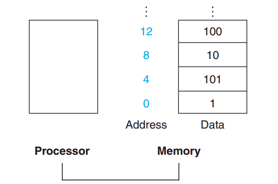

_LOAD WORD - "carregue na posição/ no registrador $x o array $y."_ 


Exemplo)

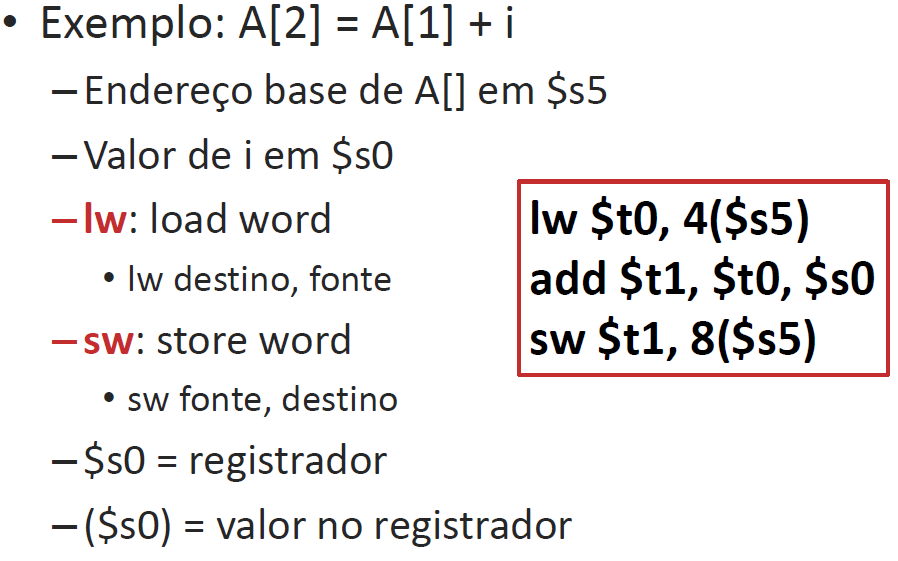

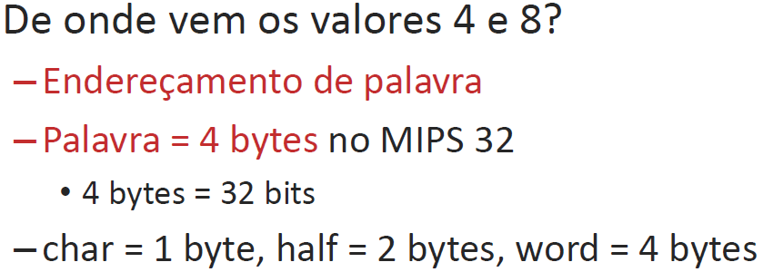

 

Exemplo) 
<br/>
```
A[12] = h + [A8], sendo que h está em $s2 e o array A está em $s3. 
Lw $t0, 32($s3) 
Add $t1, $s2, $t0 
Sw St1, 48($s3) 
```

#### Constantes 
As constantes, para não precisarem ser alocadas em memória e depois utilizadas, podemos fazer um addi, subi, ori, andi, tornando assim o processo mais rápido e consumindo menos energia. 
<br/>
<br/>
<br/>

### Princípio de Projeto: **Agilize os casos mais comuns**

#### Campos do MIPS 
| Operação | 1_operando | 2_operando resultado | qtdade desl | operação |
|----------|------------|----------------------|-------------|----------|

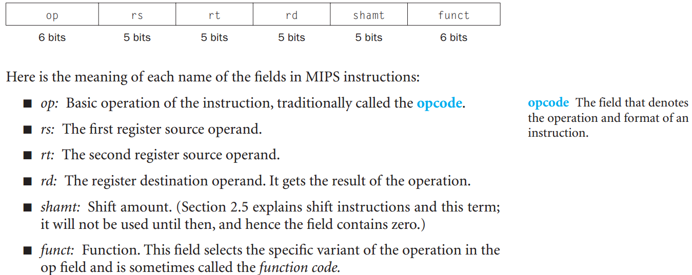
<br/>
<br/>
<br/>

### Princípio de Projeto: **Um bom projeto exige bons compromissos**
- Manter todas as instruções com o mesmo tamanho 

#### Traduzindo do assembly MIPS para linguagem de máquina: 
`A[300] = h + A[300]`, sendo que `$t1 = array A` e `$s2 = h`

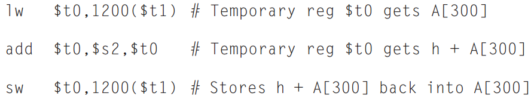

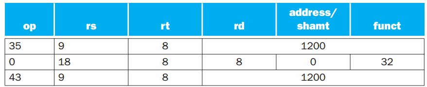

O lw é identificado por 35. 
<br/>
O sw é identificado por 43. 

### Princípios fundamentais dos computadores
- Instruções são representadas como números 
- Programas são armazenados em memória
