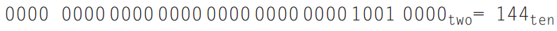

# Aula 06 - Operações lógicas 


#### Shifts (deslocamentos) 
Eles movem todos os bits de um word para a direita ou esquerda.  

Ex)
<br/> 


```
Sll - shift left logical 
Sll $t2, $s0, 4 
```
<br/>
OBS: o 4 representa quantos bits deslocados, neste caso 9 x 2^4 = 144 . 



Caso fosse feito srl seria o mesmo que dividir por 2^-4. 


#### AND 
- Só da 1 se tudo é 1. 
- Ele compara bit-a-bit  


Ele pode ser usado para mascarar alguns bits, pois ele força 0s. 

#### OR 
- Só é falso se todos são falsos. 
- Ele compara bit-a-bit  
- Oposto do AND 

#### NOR 
- Em MIPS não há somente o NOT. 
- NOR= NOT + OR 
- É 1 somente se houver um 0 em ambos. 
- `a = ¬ (b|c)` 

Exemplos: 
```mips
and $s4, $s1, $s0 

nor $t0, $s0, $zero 

and $s5, $s1, $t0 

g. subrede = ip & submascara 
hospedeiro = ip & ~submascara 
```


### Bizus! 
Se a questão der o código em assembly e pedir para converter em linguagem de alto nível. 


Sabendo que os registradores $s0, $s1, $s2 e $s3 correspondem as variáveis x, y, z e resposta. 
1 .Escreva como comentário (#) do lado de cada linha uma forma de mais fácil compreensão. 


2 .Substitua a última linha pelas variáveis dadas na questão. 


Quando temos array com constantes `Array_A[ 5 ]` pode ser transformado em lw simples, mas quando há  array com variáveis `Array_B[ Array_A[ 5 ] + 17 ]` será preciso determinar o endereço. 

Para isso, será preciso executar 4 passos. 

1. Fazer a operação que há dentro do array 


|   |   |   |   |   |   |   | Útima posição  |
|---|---|---|---|---|---|---|----------------|
|   |   |   |   |   |   |   | Temp_2         |


`$a1 = Array_B`

Depois

|   |   |   |   |   |   |   |  Útima posição    |
|---|---|---|---|---|---|---|-------------------|
|   |   |   |   |   |   |  Temp_2 |             | 


2. Deslocar o conteúdo de dentro do array sempre 2 campos (words) para a esquerda. 


3. Somar o deslocamento do conteúdo interno desse array ao próprio array. 


Desta forma este array_B está pronto para ser trabalhado como um array simples. 

4. Agora carregue o endereço dele (do array) no registrador, da mesma forma q um array simples. 


---

#### Exercícios
Considere que o endereço do array NotasDosAlunos se encontra no registrador $s0 e que a variável nota se encontra no registrador $s7. 

Escolha a sequência de instruções em linguagem de montagem que melhor representa a tradução do código abaixo feita por um compilador. 

nota = NotasDosAlunos[40] + 10 

```
sll $t0, $s0, 1 

addi $s1, $t0, 1 

f. filho_direita = pai*2 + 1
```
