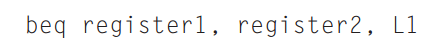
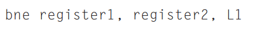
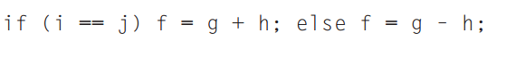
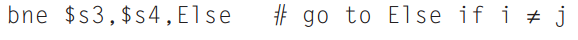
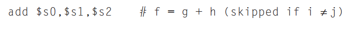
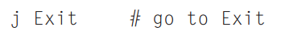
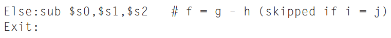

# Instruções de tomada de decisão: if-then-else e for
A grande diferença entre um computador e uma calculadora é a sua capacidade de tomar decisões. 

No assembly MIPS será necessário, para tomar decisões do tipo igual, diferente, menor que, menor ou igual, maior que, maior ou igual, realizar alguns processos equivalentes numa linguagem de alto nível, como: 
- Desvios condicionais (branch - beq e bne) 
- Desvios incondicionais (jump - j, jal e jr) 
- Comparações(slt, slti, sltu e registrador $zero) 

A arquitetura MIPS não inclui "desvio se menor que, " pois, é muito complicado. 

## Desvios
- É semelhante a tomada de decisões  utilizando if com go to e alguns rótulos (labels). 
- A visão do compilador assembly é monolítico. 

### **Branch if equal (beq)** - desviar se for igual



"_se register1 = register2, vá para L1_" 

### **Branch if not equal (bne)** - desviar se não for igual 



"_se register1 ≠ register2, vá para L1_" 

- Bizu - o código será mais eficiente se testarmos a condição oposta. 

Exemplo if-else) 



1 - Testamos o desvio 



2 - Fazemos a operação interna do if 




NOTA: Skipped - ignorada 

| Registradores  | Variáveis  |
|----------------|------------|
| $s0            | f          |
| $s1            | g          |
| $s2            | h          |
| $s3            | i          |
| $s4            | j          |


3 - Finalizamos a instrução if fazendo um desvio incondicional. Neste caso usamos o jump com o labels exit 



4 - Agora vamos para instrução else. Será preciso usar um label else para indicar que é esta parte do código e depois finalizar. 




## Comparações 
- Para verificar se uma variável é menor que outra 
- Utilizado no for e Switch/case (é um encadeamento de if-then-else) 
  - **Set on less than (slt)** - atribuir 1 se menor 
  - **Set on less than immediate (slti)** 
  - **Set on less than unsigned (sltu)** - para valores sem sinal. 

> Compara 2 registradores e atribui a um terceiro o resultado 0 ou 1.
> 
> 1, se o register1 < register2 

#### Exemplo para `for` 
```
for (i = 0 i < y i ++) { 
    x *= z 
}
```

OBS: mult é uma pseudointrução. 

```
move $s0, $zero     # muda o i de registrador e inicializa, i = 0 

 

for: slt $t1, $s0, $s6     # se i < y armazene 1 em $t1 

beq $t1, $zero, exit      # se $t1 = 0 vá para exit 

mult $s2, $s2, $s4      # x = x*z 

addi $s0, $s0, 1         # i++ 

j for 

exit: 
```


| Registradores  | Variáveis  |
|----------------|------------|
| $s0            | i          |
| $s2            | x          |
| $s4            | z          |
| $s6            | y          |
| $s4            | j          |


**NOTAS**
<br/>
- O que é a instrução move???
<br/>
> É o movimento entre 2 registradores. 
> 
> O move é usado no for para atribuir ao ponteiro X (variável que sofrera a interação) o endereço do primeiro elemento do laço. 

- O for exige sempre a instrução move para inicializar a variável. 
```
for (i=0... 
Move $s0, $zero
``` 

- Embora nas linguagens de alto nível existam vários operadores relacionais (maior, menor, menor ou igual, maior ou igual), no MIPS existe uma única instrução responsável por fazer essa comparação. Qual é essa instrução? 
- A instrução `slt` (set on less than) compara se um registrador é menor que (less than) outro, de forma similar à instrução "slti" (set on less than immediate), que compara se um registrador é menor que uma constante.  
- Tendo apenas essa instrução (<) e a instrução "beq" (branch on equal) e "bne" (branch on not equal), podemos implementar qualquer outro operador relacional. 
