# Aula 11 - Instruções de tomada de decisão: while e repeat 
## Qual a diferença entre while, for e repeat? 
- `while` e `for`: teste no início  
- `repeat`: teste no fim 
- `for` define inicialização e iteração 
- `while` e `repeat` não definem 

## Estrutura do while
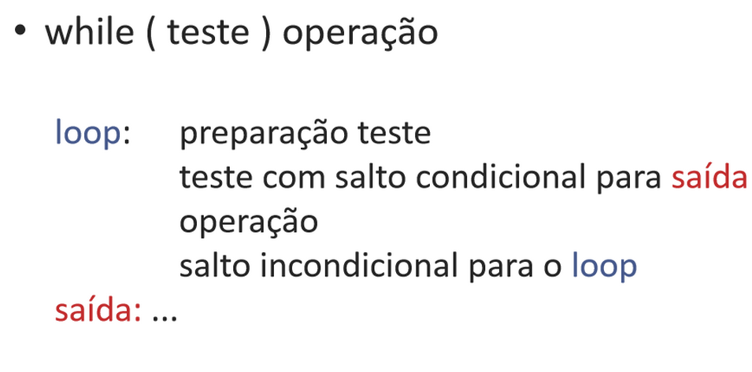
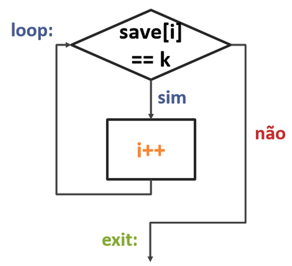


#### Exemplo de `while` 
```
while (save[i] == k) 
    i+=1 
```

| Registradores  | Variáveis  |
|----------------|------------|
| $s3            | i          |
| $s5            | k          |
| $s6            | save[]     |


1. Ler o save[i] num registrador temporário. 
- Para isso, temos que multiplicar o índice i por 4, devido ao problema de endereçamento em bytes. 

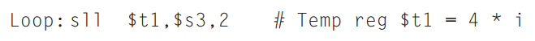

Agora, para obter o endereço de save[i].

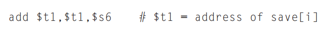

Enfim, carregar o array na memória. 

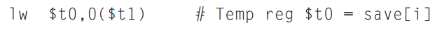


2. Determinar o desvio - se `$t0 ≠ $s5` sair do laço 

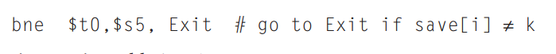

3. Fazer o conteúdo interno do while (`addi`)

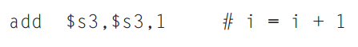

4. Finalizar o loop com um jump. 

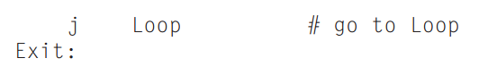
<br/>
<br/>
<br/>

## Estrutura: `for`
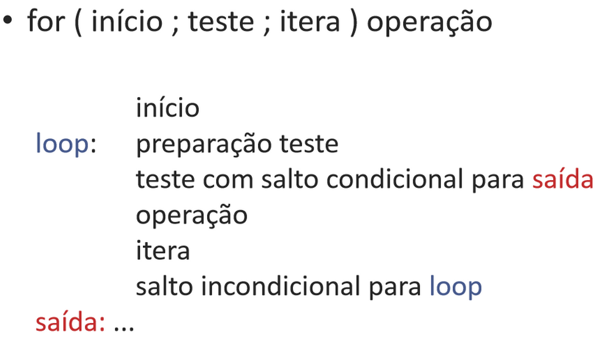

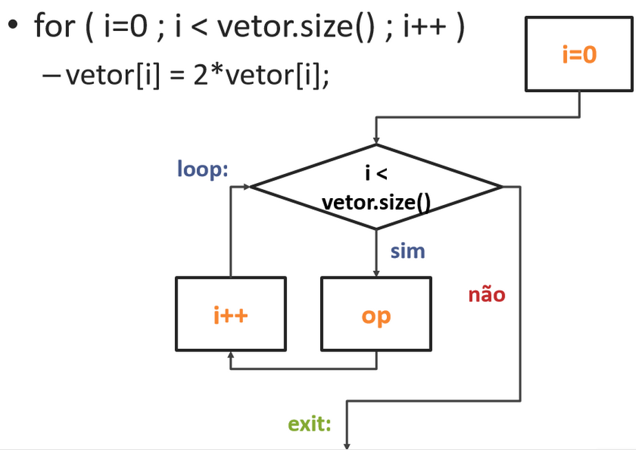
<br/>
<br/>
<br/>

## `while` X `repeat`
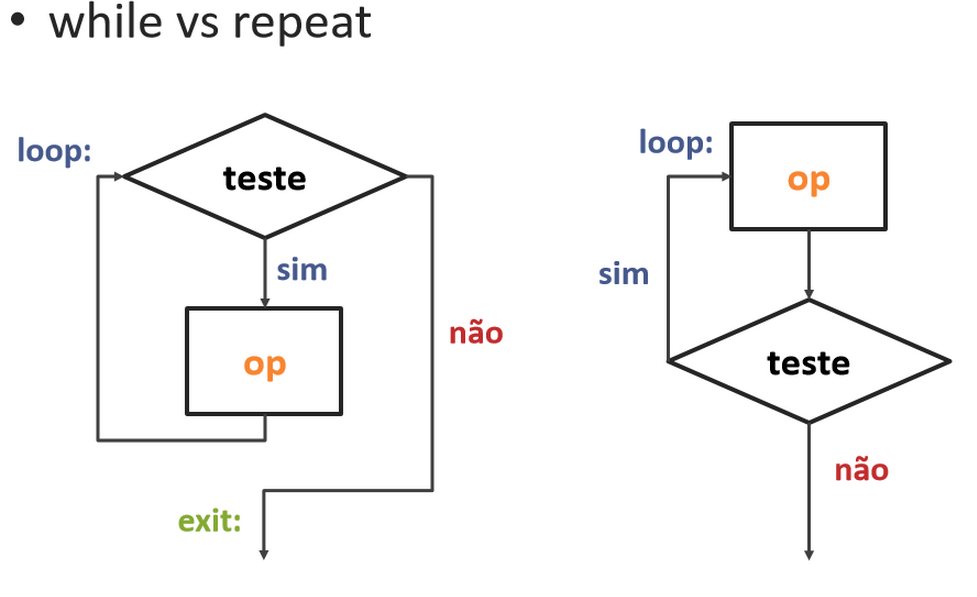
<br/>
<br/>
<br/>

## Estrutura: `if`
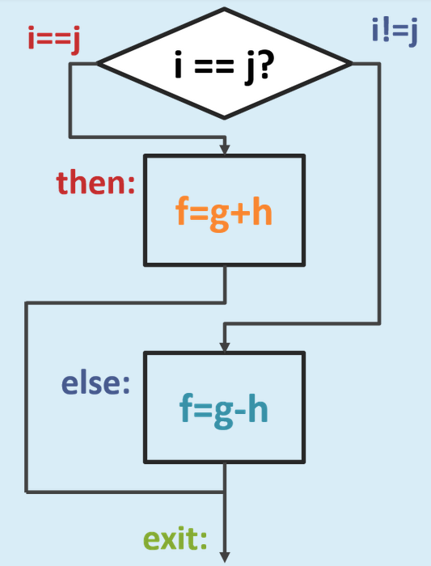

| Registradores  | Variáveis    |
|----------------|--------------|
| $s0            | maximo       |
| $s1            | n            |
| $s2            | vetor[]      |
| $s3            | i            |
|                |              |
|                | n = 4        |
|                | maximo = -1  |


## Exemplo de `for` + `if` 
```
For (i = 0 i < n i++) { 
    If (vetor [i] > maximo) 
        Maximo = vetor[i] 
} 
```

- Resolução: 
1. defina o i 
2. defina o `for` 
3. carregue o array 
4. conteúdo interno do `for` 
5. defina `if`
6. conteúdo interno do `if` 


```
Addi $s0, $zero, -1     # maximo = -1 
Move $s3, $zero         # i = 0 

for: Slt $t0, $s3, $s1 
    Beq $t0, $zero, foraFOR 
```

**Sll $t1, $s3, 2**
<br/>
**Add $t2, $t1, $s2** 
<br/>
**Lw$t3, 0($t2)** 

```
if: Slt $t4, $s0, $t3                    # armazene em $t4=1 se, maximo < vetor[i] 
    Beq $t4, $zero, exit                 # se $t4 = 0 vá para exit 

Move $s0, $t3                            # maximo = vetor[i] 

Addi $s3, $s3, 1                         # i++ 

J for 
Exit: 
```
 
---

### Exercícios
1. Dado que "a" e "b" se encontram nos registradores $a0 e $a1, respectivamente, e que "saida" será armazenada no registrador $v0, escolha o código em linguagem simbólica correto que implementa o seguinte comando em linguagem de alto nível: 
> saida = 4*(a + b) 
>
> add $t0, $a0, $a1, 
>
> sll $v0, $t0, 2 
>

>saida = a + 4*b 
>
> sll $t0, $a1, 2 
> add $v0, $t0, $a0 

> saida = 4 + a + b 
>
> addi $t0, $a0, 4 
> add $v0, $t0, $a1 

2. Considere que o endereço do array NotasDosAlunos se encontra no registrador $s0 e que a variável nota se encontra no registrador $s7. Escolha a sequência de instruções em linguagem de montagem que melhor representa a tradução do código abaixo feita por um compilador. 
<br/>
> NotasDosAlunos[10] = nota 
> 
> sw $s7, 40($s0) 

> nota = NotasDosAlunos[40] + 10 
>
> lw $t0, 160($s0) 
>
> addi $s7, $t0, 10 

> NotasDosAlunos[40] = 0 
> 
> sw $zero, 160($s0) 

> NotasDosAlunos[10] = 10 
>
> addi $t0, $zero, 10 
>
> sw $t0, 40($s0) 


3. Escolha a opção que ilustra uma possível implementação em linguagem de alto nível para o código em linguagem simbólica abaixo. 
```
add $s0, $s1, $s2 
addi $s1, $s1, 1 
```
> saida = a + b 
>
> a = a + 1 
