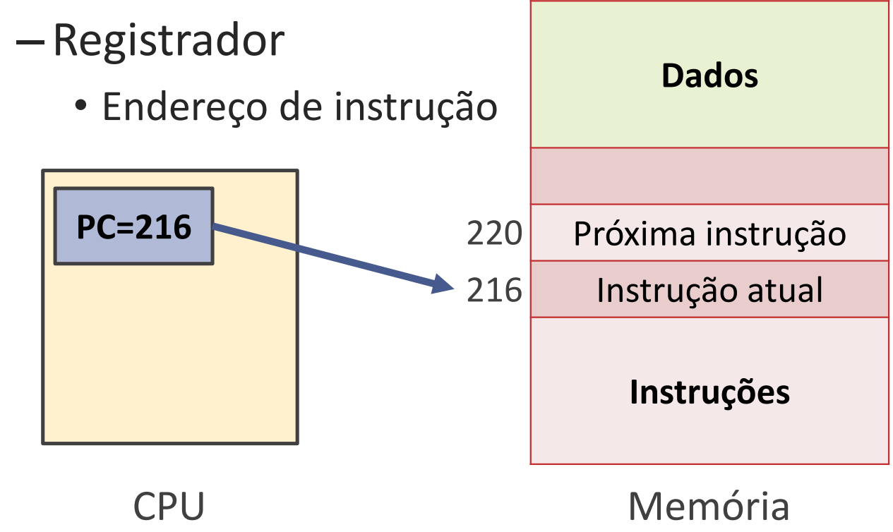
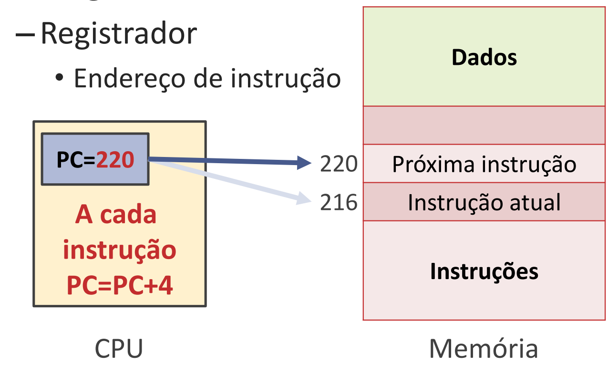

# Suporte a procedimentos

## Procedimentos em computação 
- É uma estratégia utilizada a fim de estruturar programas em módulos (blocos) para torná-los mais fáceis de entender quanto permitir que o código seja reutilizado. 
- Rotina, Sub-rotina, funções ou métodos 
  - Efetuam uma tarefa específica 
  - baseada em parâmetros passados 

### Vantagens 
- Estruturação do programa 
- Reutilização de código 
- Isolamento do resto do programa 
- Entrada: argumentos ou parâmetros 
- Saída: valores retornados 

### Como funciona
Uma sub-rotina no HW do computador precisa seguir 6 passos
1. Colocar os argumentos num lugar onde o procedimento possa acessá-los
2. Transferir o controle para o procedimento 
3. Adquirir os recursos de armazenamento necessários para executar o procedimento 
4. Efetuar a tarefa desejada 
5. Colocar o resultado num lugar onde o programa chamador possa acessá-lo 
6. Retornar o controle ao ponto de origem. 

#### No MIPS
O MIPS utiliza os seguintes registradores para armazenar procedimentos
- `$a0-$a3`: para armazenar argumentos 
- `$v0-$v1`: para armazenar valores de retorno 
- `$ra`: para armazenar o endereço de retorno  

#### jump-and-link (jal) 
O MIPS inclui uma instrução especifica para procedimentos: 
- Salta para um endereço e simultaneamente salva em `$ra` o endereço da próxima instrução `$ra = PC+4` 
- O "link" significa que ele armazenou o endereço de retorno. 
- Desvia para o endereço (PC = Endereço) 
- Programa armazenado! 

 
#### jump register (jr)
- jr $ra  #le o endereco em $ra 
- Program Couter (PC) 
- Contador de programa. 
- Registrador de endereço de instrução sendo executada. 
- Quando executamos a instrução `jal` será salvo no registrador `$ra (PC + 4)`

#### Bizus
- **Antes de invocar o procedimento**, escreva na memória o conteúdo dos registradores a serem utilizados pelo procedimento chamado 
- **Salvamento do contexto do procedimento chamador**
  - Depois de executar o procedimento 
  - Restaurar os valores originais nos registradores 
  - Restauração do contexto do procedimento chamador 

---

#### Exercícios
1. Qual o mnemônico da instrução de desvios incondicionais que armazena o valor de PC+4 no registrador de endereço de retorno? 
> jal 

2. O MIPS possui três instruções de desvio incondicional, que são j, jr e jal. A ultima salva o endereço da próxima instrução no registrador $ra e então desvia o fluxo de execução para o endereço no rótulo da instrução. Dessa forma a instrução jal é utilizada para invocar um procedimento, enquanto uma instrução jr $ra serve para retornar de um procedimento. 
> v 

3. Em um computador moderno as instruções são representadas por números binários, e programas são armazenados na memória para serem lidos ou escritos pelo processador. Esse é o conceito de: 
> programa armazenado 
