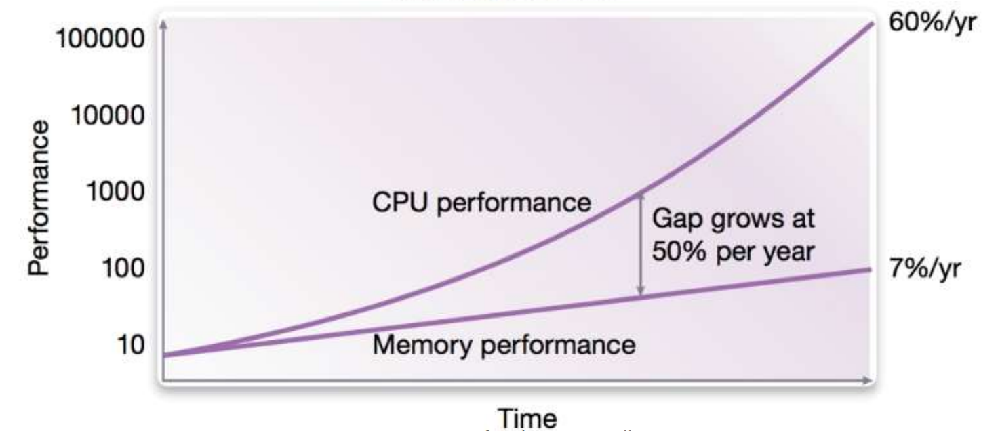
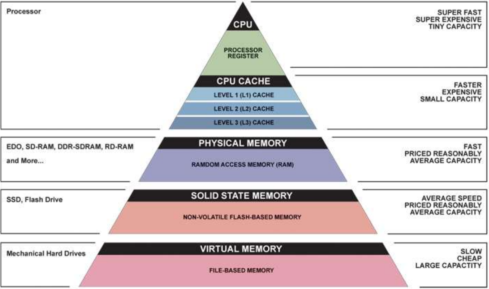
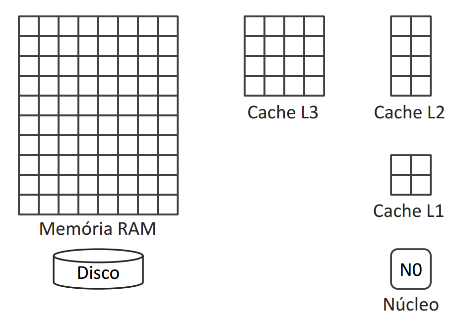
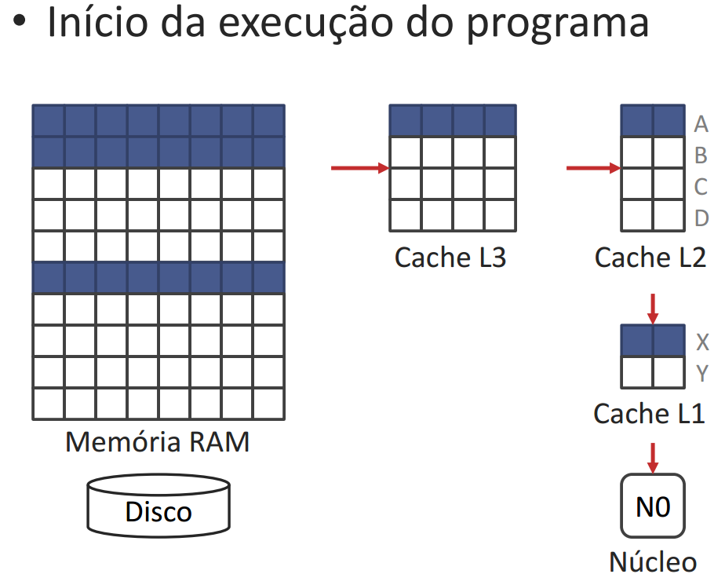
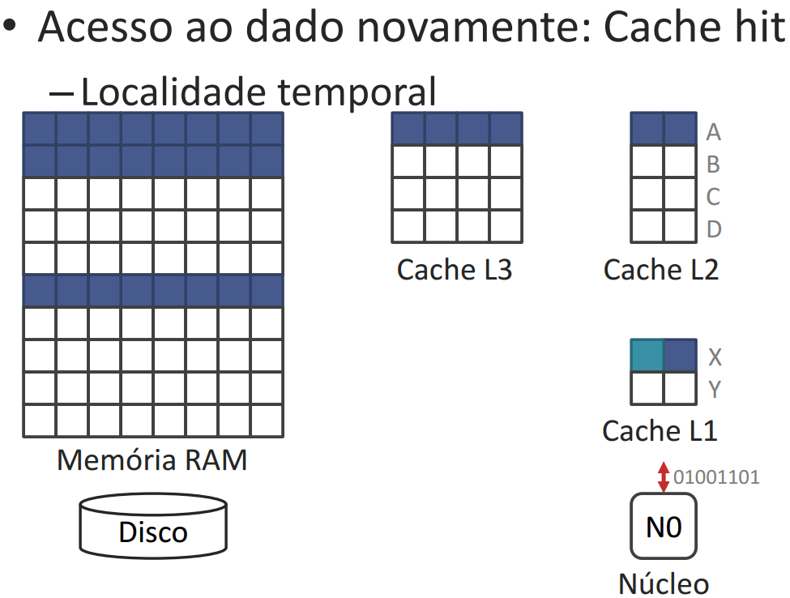
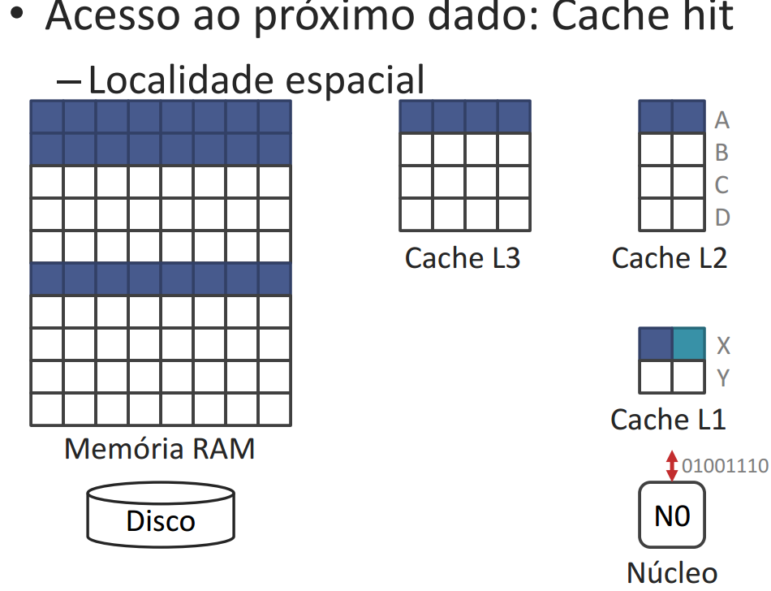
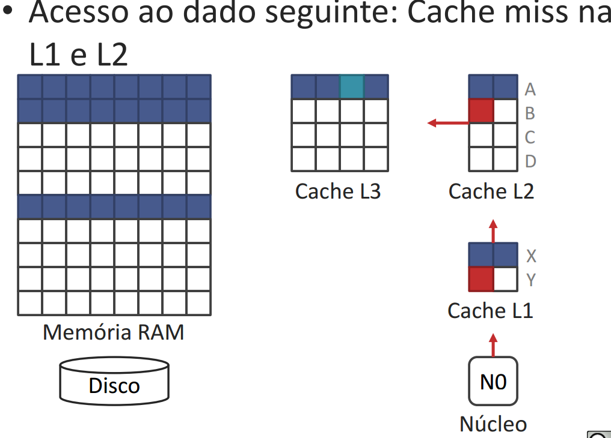

# Princípios de localidade e hierarquia de memória
## Memory wall  
- Memory wall ≡ Barrier power 
- Há uma grande disparidade de desempenho entre memória e processador. 

Exemplo) Processador de 2 GHz executa uma instrução por ciclo. 
- tempoCPU = CPI*frequência 
- CPI = 1 
- 0,5 ns /ciclo 
- 20% das instruções acessam a memória 
- Cada acesso à memória leva 100 ciclos, 0,5*100  = 50 ns 
- Quanto tempo cada instrução deveria levar? 
> 0,5 ns 
- Qual o tempo médio das instruções realmente? 
> 0,5 ns + 0,2*50 ns = 10,5 ns (~95MHz) 

### Amenização do memory wall
- Para amenizar os efeitos do memory wall inserimos memorias intermediárias. 
- Exemplo
  - se 95% dos acessos levassem 5 ciclos na memória intermediária (os outros 5% precisam de mais 100 ciclos) 
  - = 0,5 ns + 0,2*(2,5 + 0,05*50) ns 
  - OBS: 0,5 ns por ciclos * 5 ciclos na memória intermediária = 2,5 
  - = 0,5 + 0,2*(2,5 + 2,5) 
  - = 0,5 + 1 = 1,5 ns 
  - 666 MHz ou ~7x melhor do que antes 

As memórias intermediarias formam a hierarquia de memória. 

## Hierarquia de memória 
O principal objetivo de se ter uma hierarquia de memória é o melhoramento do desempenho. 
- Quanto mais longe da CPU: 
  - Maior a capacidade 
  - Mais lenta  
  - Mais barata 

## PRINCÍPIO DA LOCALIDADE 
Analogia da biblioteca 
- Livros na estante 
  - Muitos livros, acesso lento 
- Livros na mesa 
  - Poucos livros, acesso rápido 
- Livro na mão 
  - Um livro, acesso muito rápido 

### Dois tipos de localidade 
#### Localidade temporal 
- Se um endereço é referenciado, é provável que ele seja referenciado em breve. 
- Se você trouxe um livro para mesa é provável que precise examiná-lo novamente em breve. 

#### Localidade espacial 
- Se um endereço é referenciado, é provável que endereços próximos sejam referenciados em breve. 
- Os livros sobre o mesmo assunto são colocados juntos na biblioteca para aumentar a localidade espacial. 

#### Exemplos do princípio da localidade
- MUITOS LAÇOS -  Alta localidade temporal a instruções. Um programa com muitos laços acessa repetidamente as mesmas instruções e, portanto, tem alta localidade temporal em relação às instruções. 
-MUITO USO DE ARRAY - Alta localidade espacial a dados. 
- MUITO USO DE VARIÁVEIS DE ÍNDICE E CONTROLE DE LAÇOS - Alta localidade temporal a dados. 
- MUITOS DESVIOS

 
### Funcionamento do princípio da localidade
A memória é feita de blocos (unidade mínima)

- Quando um dado sai do disco ele passará por todos os níveis de memória até chegar no núcleo. 
- No L1 a L3 os dados são cópias da memória principal, ou seja, eles repetem as mesmas informações. 

### Acessos à cache 
O termo cache, é usado para qualquer armazenamento que utiliza o princípio de localidade. 
 
- Acerto (**cache hit**): Endereço acessado se encontra na cache. 
  - Tudo ok 
  - Tempo para consultar um livro na mesa 
- Falha (**cache miss**): Endereço acessado não se encontra na cache. 
  - Pede para o próximo nível na hierarquia pelo dado. 
  - Tempo de apanhar outro livro na estante e colocá-lo na mesa. 
  - Para uma falha de cache é criado um stall semelhante ao pipeline 

