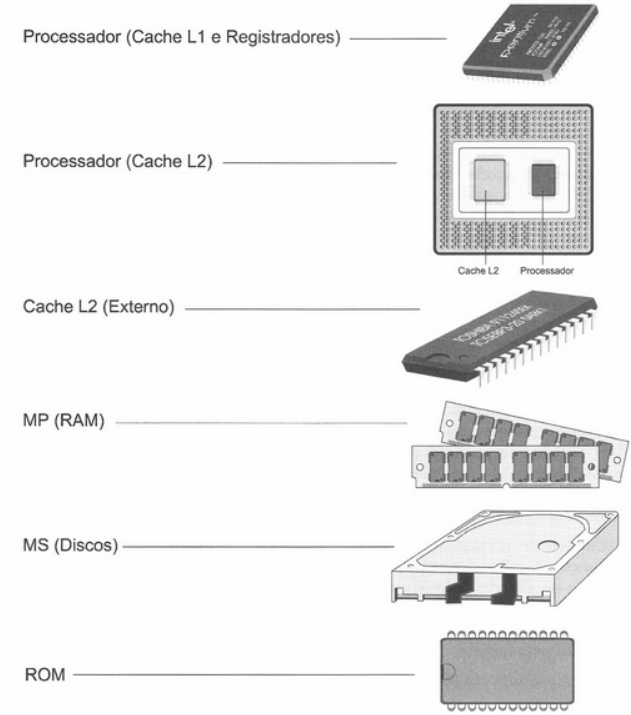
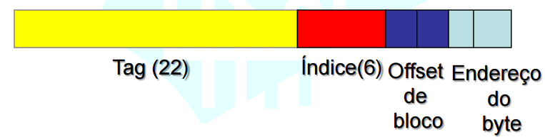
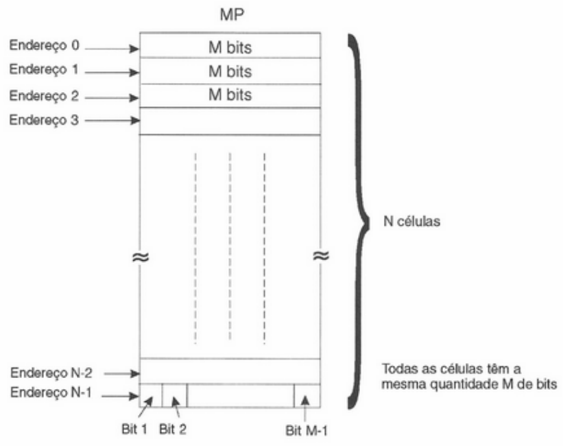
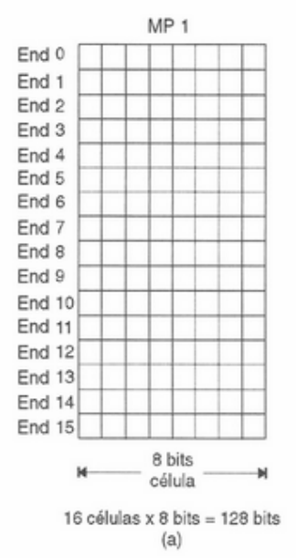

## Princípios básicos de memória 

### Localização de memórias

### Componentes da memória
- `Células` é a organização da memória principal (padrão 8 bits). 
- `Bloco` é a organização da cache. Um bloco pode conter vários locais diferentes da memória. 
- `Word` é Conjunto de células com significado 
- `Endereço de memória` é o elemento que indica a unidade de armazenamento. 
- Este endereço, em forma de valor binário, é enviado pelo processador (sempre que este realiza um acesso à memória) para o barramento do sistema. 
  - Todas as posições de memória possuem um endereço. Como uma memória é constituída de vários desses grupos de bits (célula, bloco etc.), é necessário que seja definido um método para identificar univocamente cada uma dessas células (ou blocos), de modo que possa ser distintamente identificado o grupo de bits desejado para um certo processamento. Por exemplo, uma rua podem possuir 100 casas rigorosamente iguais, de tal forma que não se possa visualmente distinguir uma da outra. No entanto, o carteiro não erra ao entregar diariamente a correspondência, pois cada casa possui uma forma única de identificação, um número fixado em sua porta ou fachada.

A informação copiada de um disco rígido vai ser replicada em todas as memorias. 
Exemplo simples de memória principal:

Cache de dados e cache de instruções – Vantagens: • Melhor capacidade de otimizações • Evita hazard estrutural – Desvantagens:
- maior taxa de falta
