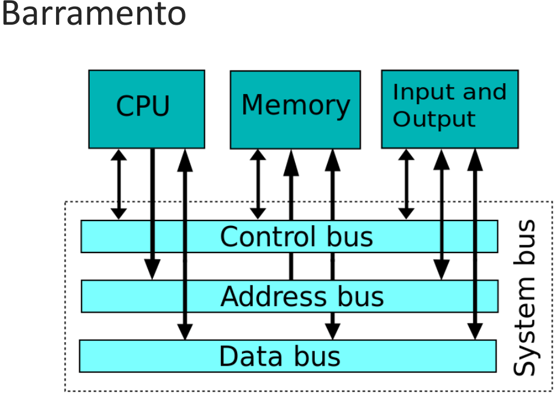
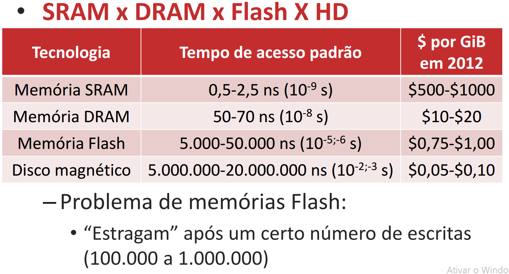

# Componentes de um computador

Todos os computadores realizam as mesmas funções básicas: 
- Processar
- Armazenamento de dados
- Entrada/Saída de dados

Isto é baseado no modelo Von Neumann.

#### Os 5 componentes básicos 
- Input 
- Output 
- Memória 
- DataPath 
- Caminho de controle 

## Processadores

2 componentes principais:
- **Datapath**
  - Realiza operações sobre os dados
- **Control**
  - Informa ao datapath, memória e dispositivos de I/O o que deve ser feito em função das instruções do programa.

### Tipos de Processador
- GPP: General purpose processor
- GPU: Graphics processing unit
- DSP: Digital signal processor

#### ISA
- Inclui tudo que um programador precisa saber para gerar um binário que funcione
- Intel x86-64, ARMv7-A

#### ASIC 
ARM não é um tipo de processador e sim uma ISA. 

## Barramentos
É o canal que o processador se comunica

## Memórias
- Memória armazena dados
- Identificados por **endereços**
- Endereços apontam **words**
- Words possuem múltiplos **bytes**
  - 4 bytes para 32 bits, 8 bytes para 64 bits
- Words são grupos em **blocos**
 - Importante para caches

### Hierarquia de memória

### Static RAM (SRAM)
- Não representa uma memória não-volátil: SRAM ( Static Random Access Memory). 
- São os registradores 
- Não precisando que as células que armazenam os bits sejam atualizadas (de tempos em tempos) usualmente chamada de refreshing, como é o caso das memórias DRAM. 

#### Vantagens 
- A memória RAM estática é mais econômica, além de entregar mais performance. 

### Dynamic RAM (DRAM)

