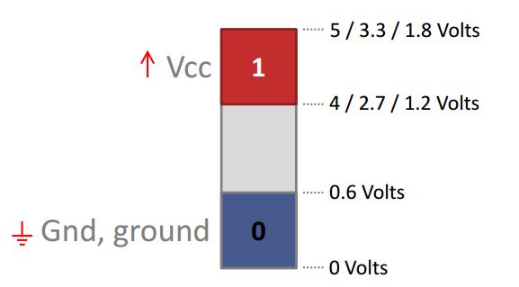

# Semicondutores e processo de fabricação 

## Noções básicas 
- A tecnologia de circuitos integrados (chips) determina a velocidade de evolução dos computadores. 
- Chave liga/desliga controlada eletricamente. Um transistor é um componente eletrônico que funciona como um interruptor, deixando ou não passar corrente elétrica; porém, ele é acionado também por corrente elétrica. 
- Um transistor precisa fazer três coisas bem
1. Deixar passar o máximo de corrente possível quando ligado 
    -  Active current  
2. Seixar o mínimo de corrente passar quando desligado  
    - Leakage current  
3. Trocar entre estados o mais rápido possível 
    - Nos sistemas digitais, diferentes níveis lógicos são representados por diferentes valores ou faixas de tensão elétrica  

## MOS
Modelo: TRANSISTOR MOS (MOS = Metal-oxide-semiconductor) 

### nMOS e pMOS

NMOS: 
 
- Off = 0 
- On = 1 

### Do transistor ao processador 
- Os transistores são usados para montar portas lógicas e assim manipular os bits. 
- A partir de portas lógicas básicas (E, OU, NÃO, etc), é possível montar uma infinidade de funções menos simples  

