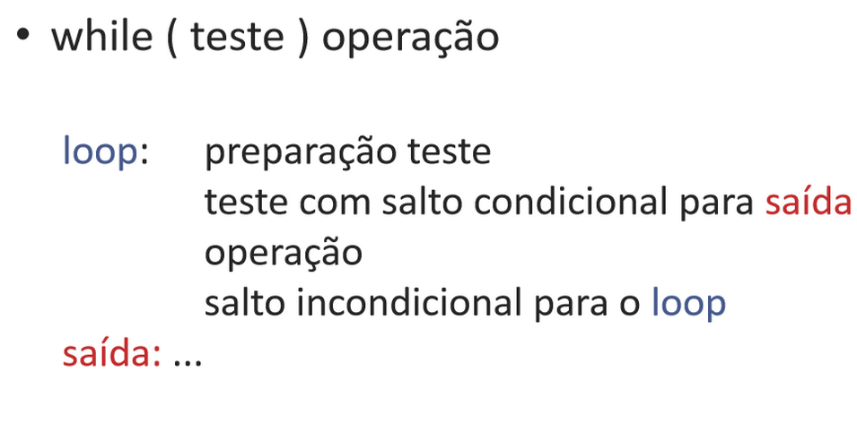
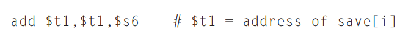
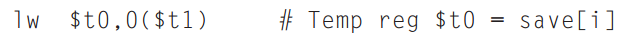
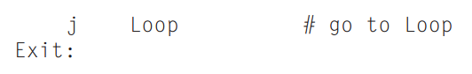
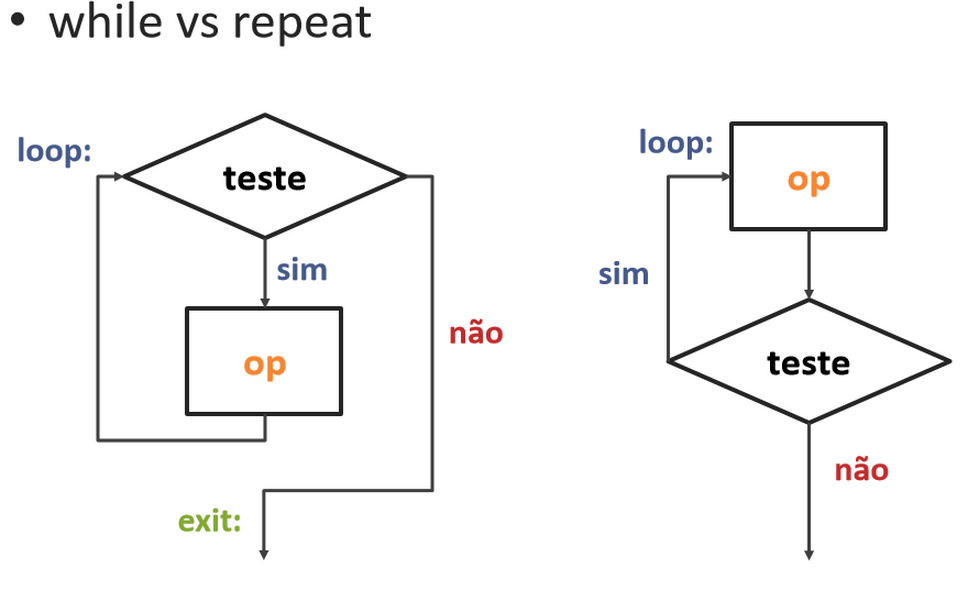

# Aula 11 - Instruções de tomada de decisão: while e repeat 

Qual a diferença entre while, for e repeat? 

 

while e for: teste no início  

repeat: teste no fim 

for define inicialização e iteração 

while e repeat não definem 

 

 

Estrutura do while: 

 



Exemplo de while) 
```
while (save[i] == k) 
    i+=1; 
```
| Registradores  | Variáveis  |
|----------------|------------|
| $s3            | i          |
| $s5            | k          |
| $s6            | save[]     |


1⁰ - Ler o save[i] num registrador temporário. 

Para isso, temos que multiplicar o índice i por 4, devido ao problema de endereçamento em bytes. 


Agora, para obter o endereço de save[i].



Enfim, carregar o array na memória. 




2⁰ - Determinar o desvio - se $t0 ≠ $s5 sair do laço 


 

3⁰ - Fazer o conteúdo interno do while (addi) 


4⁰ - Finalizar o loop com um jump. 



## Estrutura: `for`


## `while` X `repeat`



## Estrutura: `if`


| Registradores  | Variáveis    |
|----------------|--------------|
| $s0            | maximo       |
| $s1            | n            |
| $s2            | vetor[]      |
| $s3            | i            |
|                |              |
|                | n = 4        |
|                | maximo = -1  |


Exemplo de for + if) 

 

For (i = 0; i < n; i++) 

{ 

If (vetor [i] > maximo) 

Maximo = vetor[i]; 

} 

 

 

Resolução: 

1⁰ passo) defina o i 

2⁰ passo) defina o for 

3⁰ passo) carregue o array 

4⁰ passo) conteúdo interno do for 

5⁰ passo) defina if 

6⁰ passo) conteúdo interno do if 

                    Sll $t1, $s3, 2 

                    Add $t2, $t1, $s2 

                    Lw$t3, 0($t2) 


 

Addi $s0, $zero, -1     # maximo = -1 

Move $s3, $zero         # i = 0 

 

for: Slt $t0, $s3, $s1 

Beq $t0, $zero, foraFOR 


if: Slt $t4, $s0, $t3                    # armazene em $t4=1 se, maximo < vetor[i] 

    Beq $t4, $zero, exit               # se $t4 = 0 vá para exit 

 

Move $s0, $t3                     # maximo = vetor[i] 

 

Addi $s3, $s3, 1                       # i++ 


J for 

Exit: 

 
---
Exercícios da lista 02: 

 

Dado que "a" e "b" se encontram nos registradores $a0 e $a1, respectivamente, e que "saida" será armazenada no registrador $v0, escolha o código em linguagem simbólica correto que implementa o seguinte comando em linguagem de alto nível: 

saida = 4*(a + b) 

add $t0, $a0, $a1, 

sll $v0, $t0, 2 

 

saida = a + 4*b 

sll $t0, $a1, 2 

add $v0, $t0, $a0 

 

saida = 4 + a + b 

addi $t0, $a0, 4 
add $v0, $t0, $a1 

 

Considere que o endereço do array NotasDosAlunos se encontra no registrador $s0 e que a variável nota se encontra no registrador $s7. 

Escolha a sequência de instruções em linguagem de montagem que melhor representa a tradução do código abaixo feita por um compilador. 

NotasDosAlunos[10] = nota 

sw $s7, 40($s0) 

 

nota = NotasDosAlunos[40] + 10 

lw $t0, 160($s0) 

addi $s7, $t0, 10 

 

NotasDosAlunos[40] = 0 

sw $zero, 160($s0) 

 

NotasDosAlunos[10] = 10 

addi $t0, $zero, 10 
sw $t0, 40($s0) 

 

