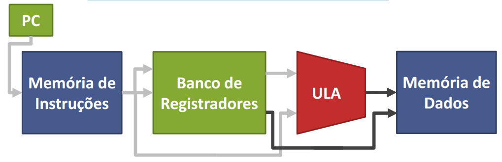
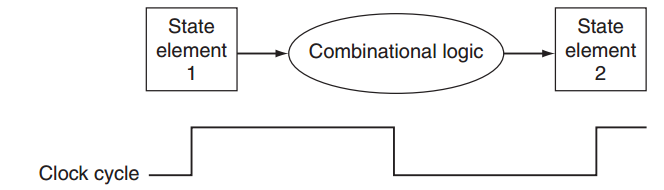

# processadores monociclos 

Principais componentes dentro de um processador: 

 

 

Datapath + Controle 

É o registrador que contém o endereço da instrução que está sendo executada 

Necessário para dizer qual é a próxima instrução a ser executada  - > PC = PC + 4 para instruções simples 

Armazena as instruções do programa 

Memória de instruções precisa ser lida para cada instrução 

Não escrevemos na memória de instruções! 

MIPS32 

Load: usa endereço para ler valor 

Store: usa endereço para escrever valor 

Contém os registradores usados para a execução de instruções ($s0-7, $t0-9, $zero, $sp, etc.) 

MIPS32 

Máximo leitura de 2 registradores 

Máximo escrita em 1 registrador 

Realiza os cálculos exigidos pelas instruções, Soma (valores ou endereços), subtração,deslocamento, operações bit a bit. 

MIPS32 

Dois valores são usados como operandos 

Um valor é gerado como resultado 

Mantém todos os dados de um programa 

• Variáveis, vetores, estruturas de dados, etc. 

Valores podem ser lidos e escritos 

Como instruções são executadas? 

 

– Exemplos 

add $s0, $s1, $s2 

sw $t1, 24($s0) 

Lw $t0, 20($s0) 

 

1º passo: Busca da instrução 

• O PC lê da memória e interpreta o que deve ser feito 

2º passo: Leitura dos registradores 

• O PC lê $s0 para somar com 24, $t1 para armazenar 

3º passo: sw $t1, 24($s0) – Operação: Unidade Lógica e Aritmética (ULA) 

• Somar $s0 e 24 para calcular o endereço 

4º passo: Acesso à memória de dados 

O PC armazena o valor de $t1 em $s0+24 

sw $t1, 24($s0) 

5º passo: Escrita do registrador 

Armazenar em $t0 o valor lido em $s0+20 

lw $t0, 20($s0) 

## Principais características: 

 

Instruções levam um ciclo de relógio  para serem executadas. 

CPI = 1 

Desvantagem: O ciclo de relógio tem duração fixa, definido pela instrução mais lenta. 

Frequência muito baixa 

Tudo tem que ser feito dentro do ciclo. Consequência disso, é que acaba gerando uma ineficiência e não segue um princípio de projeto que é tornar os casos comuns mais rápidos. 

Por ser monociclo nenhum recurso pode ser usado mais de uma vez por instrução. Então precisamos de uma memória separada para instruções e outra para memória de dados. 

 

Cálculos de tempo de CPU para processadores monociclos são os vistos na aula 04. 

 

Tempo CPU = I*CPI / frequência 

 

 

Para implementar instruções há 2 etapas que sempre serão idênticas em qualquer tipo de instrução: 

A busca da instrução feita pelo PC - contador de programa 

Ler um ou mais registradores 

 

 

No datapath (caminho de dados) possuem 2 tipos de elemento lógicos: 

Aqueles que operam valores dos dados  (combinacionais,  ALU) 

Aqueles que contem estados (elemento de estado) 

 

Metodologia de clocking: 

 

Determina quando os dados podem ser lidos e quando podem ser escritos. 

Tem o objetivo de garantir a previsibilidade. 

As entradas são valores escritos em um ciclo de clock anterior, enquanto as saídas são valores que podem ser usados em ciclo seguinte. 

Instruções do tipo R - são instruções logicas ou aritméticas: add, sub, AND, OR e slt 
