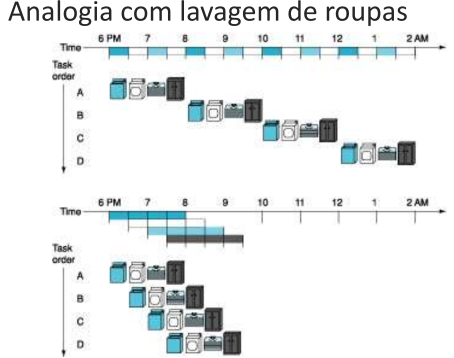
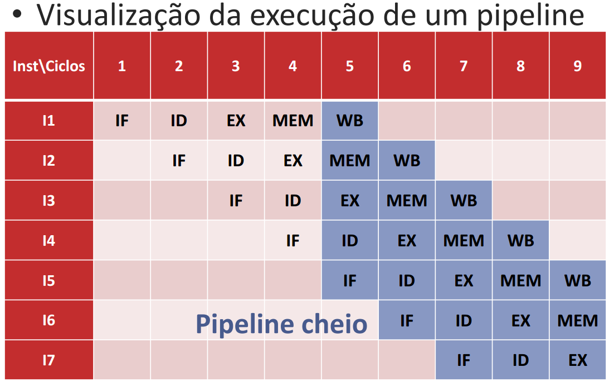
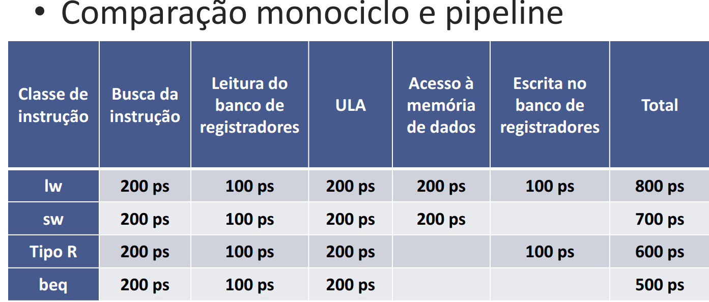
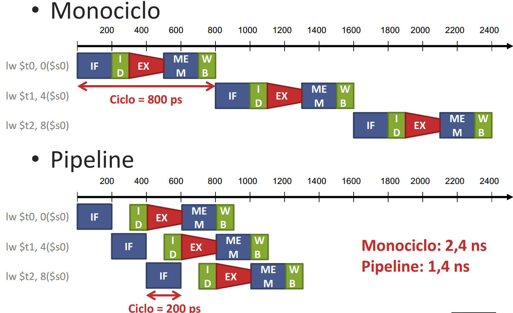
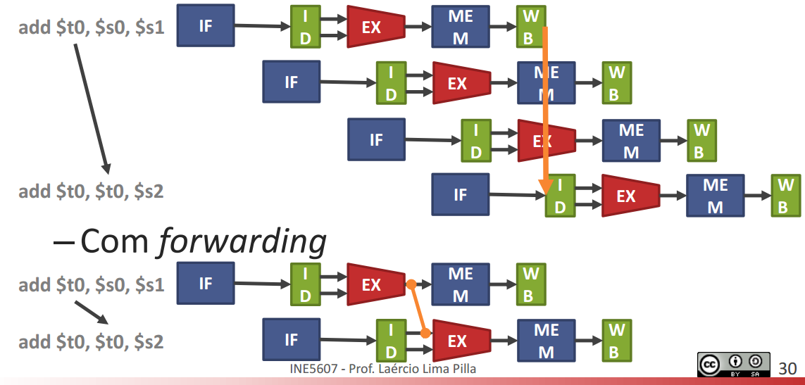
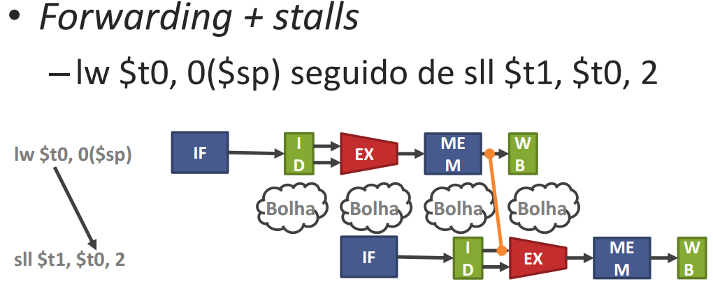

# Processadores pipeline 

Paralelismo em nível de instrução (instruction level parallelism) 

 

 

A visão de um programa sequencial é preservada 

Programamos instrução após instrução 

Execução paralela de instruções ou partes de instruções de um mesmo fluxo 

 

 

Pipelinig 

 

Técnica de sobreposição de instruções em execução. 

Cada instrução utiliza componentes diferentes em um dado ciclo. 

Uma instrução é lida, outra usa a ULA, outra escreve na memória, etc. 

CPI próximo de 1  

CPI = (1/largura)*(1/utilização) 

Aplicação de comandos com pipe “|”. 

Não muda o tempo de execução de uma instrução (a latência de uma instrução). 

Aumenta a vazão de instruções: Mais instruções em um dado período de tempo. 

 

Aceleração potencial = número de estágios do pipeline 

Tempo de lavagem de roupa 

– Em sequência: 8 horas 

– Pipeline: 3,5 horas com uma aceleração de potencial = 4 

 

Etapas de uma instrução MIPS 

 

1. Buscar a instrução na memória (IF) 

2. Decodificação; leitura de registradores (ID) 

3. Execução: operação/cálculo de endereço (EX) 

4. Acesso a operando em memória (MEM) 

5. Escrita do resultado em registrador (WB) 

 

"ifidex men wb" 

 

Etapas para uma instrução de load word:

Tempo de ciclo 

• Monociclo: 800 ps (lw como pior caso) 

• Pipeline: 200 ps (memória ou ULA como pior caso). Trabalha com os 5 componentes ao mesmo tempo, por isso só importa o componente mais lento. 

 

O que são estágios, níveis ou etapas de pipeline? 

 

São os componentes que o PC executa - ifdex mem WB 

 

 

Exemplos de processadores INTEL: 

Pentium 4 : 2 GHz- 20 estágios de pipeline 

Pentium D:  dual core, 3,7 GHz - 31 estágios de pipeline 

Core i7: 6 cores, 2 GHz - 14 estágios de pipeline 

  

A frequência e quantidade de pipeline diminuíram porque agora os estágios são divididos entre os cores. 

 

 
HAZARDS 

 

São os Problemas de pipelines.  

Há 3 tipos: 

Hazards estruturais: Duas instruções precisando dos mesmos recursos de hardware ao mesmo tempo 

Hazards de dados: Dados necessários para uma instrução ainda não estão disponíveis 

Hazards de controle (ou de desvio): Instrução buscada não é a que deve ser executada 

 

 

Soluções para hazards gerais: 

 

Reordenação de instruções no código 

Instruções independentes em sequência 

Stalls: Inserção de bolhas no pipeline 

 

 

Soluções para hazard de dados: 

 

Forwarding: Encaminhamento de valores já calculados para serem utilizados por instruções antes da escrita no banco de registradores.  

Exemplo) 

 

Bolhas: Inserir um ciclo com estágios vazios. 

Soluções para hazards de controle: 

 

– Delay slot: Coloca instruções após o branch para serem executadas de qualquer forma 

– Execução especulativa: Executa a instrução logo após o branch 

– Previsão de desvios 

• Mecanismos para tentar adivinhar se o desvio será tomado ou não 

• Previsão de desvios dinâmica: Uso de um histórico dos desvios para a tomada de decisões (Tabela de histórico de desvios (BHT)) 

## Exercícios

| Nome  | Grandeza  |
|-------|-------|
| mega  | 10^6  |
| giga  | 10^9  |

| bilhão  | 10^9   |
|---------|--------|
| milhão  | 10^6   |
| nano    | 10^-9  |
| micro   | 10^-6  |

Com cálculos
Dado um processador pipeline de 13 estágios, quantos ciclos são necessário para a execução de 78029 instruções se não ocorrerem stalls? 

 

(Estágios -1 )+ (instruções) = ciclos 

13 + 78028 = 78041  

 

OBS: caso tenha despachos múltiplos, as instruções serão divididas pela quantidade de despachos. 

 

 

Dado um processador pipeline de 7 estágios, quantos ciclos são necessário para a execução de 88256 instruções se 11% das instruções resultam em stalls de 1 ciclo? 

 

7 estágios 

88256*1,11 = 97964,16 

97964,16 + 7 = 97971,16 então 97972 

---

Um processador pipeline de 11 estágios com despacho múltiplo dinâmico de largura 4 consegue executar um programa com 13,6 bilhões de instruções mantendo 13% de utilização nos recursos (exemplo: 20% de ociosidade = 80% de utilização). 

Dado que o processador executa em uma frequência de 1,3 GHz, qual o tempo total de execução do programa em segundos? Respostas devem incluir até duas casas após a virgula. 

 

 

Resolução: 

 

Use a fórmula do tempo de CPU. 

São 13% de utilização - valor usado na fórmula. 

CPI = (1/largura)*(1/utilização) 

 

20,11 

 

 

 

Um processador pipeline de 9 estágios com despacho múltiplo dinâmico de largura 5 consegue executar um programa com 22,7 bilhões de instruções mantendo 46% de ociosidade nos recursos (exemplo: 20% de ociosidade = 80% de utilização). 

Dado que o processador executa em uma frequência de 3,3 GHz, qual o tempo total de execução do programa em segundos? Respostas devem incluir até duas casas após a virgula.  
 

Resolução: 

Tempo = (I*CPI)/f 

22,7*(1/5*1/0,54)/3,3 = 2,54 

 

 

Um processador pipeline de 2 estágios com despacho múltiplo dinâmico de largura 6 consegue executar um programa com 125 bilhões de instruções sem precisar interromper o pipeline e sem manter recursos ociosos (100% de utilização) 

Dado que o processador executa em uma frequência de 1,3 GHz, qual o tempo total de execução do programa em segundos? Respostas devem incluir até duas casas após a virgula.  
 

Resolução: 

Tempo = (I*CPI)/f 

125*(1/6)/1,3 = 16,02 

 

Um processador pipeline de 9 estágios consegue executar um programa com 45,4 milhões de instruções sem precisar interromper o pipeline ou inserir bolhas. 

Dado que o processador executa em uma frequência de 1,3 MHz, qual o tempo total de execução do programa em segundos? Respostas devem incluir até duas casas após a virgula.  
 

Resolução: 

45,4/1,3 = 34,92 

---

Um processador pipeline de 7 estágios consegue executar um programa com 134,4 milhões de instruções sem precisar interromper o pipeline ou inserir bolhas. Dado que o processador executa em uma frequência de 130 MHz, qual o tempo total de execução do programa em segundos? Respostas devem incluir até duas casas após a virgula. 

 

 

Resolução (professor): 

Como estamos tratando de um grande número de instruções, a profundidade do pipeline não afeta o resultado final (apenas afeta a frequência de operação alcançada pelo processador). 

Sabendo que t = I*CPI/f e que o CPI de um processador pipeline em condições perfeitas de operação é 1, temos 

t = 134,4*10^6*1/130*10^6 = 134,4/130 =~ 1,03 segundos 

  

 

Um processador pipeline de 6 estágios com despacho múltiplo dinâmico de largura 6 consegue executar um programa com 25,0 bilhões de instruções mantendo 42% de ociosidade nos recursos (exemplo: 20% de ociosidade = 80% de utilização). Dado que o processador executa em uma frequência de 3,8 GHz, qual o tempo total de execução do programa em segundos? Respostas devem incluir até duas casas após a virgula.  

 

Resolução (professor): 

A utilização do processador afeta diretamente quantos ciclos precisaremos para terminar as instruções. No caso da questão, o processador apresentaria IPC = 6 no caso de utilização de 100% dos recursos. 

Como estamos usando apenas 58% dos recursos, o número de instruções que poderão ser terminadas por ciclo (IPC_real) será igual ao IPC_otimo * utilização. No nosso caso, IPC_real = 6*0,58 = 3,48. 

Sabendo o CPI do processador (1/IPC), temos 

t = 25*10^9*(1/3,48)/(3,8*10^9) = 25/(3,48*3,8) =~ 1,89 segundos

---
pipeline

Caso um processador pipeline e um processador multiciclo sejam feitos com componentes de mesma tecnologia, poderia se esperar que eles tivessem o mesmo CPI. 

 

 

Falso 

 

Caso um processador pipeline e um processador multiciclo sejam feitos com componentes de mesma tecnologia, poderia se esperar que eles tivessem o mesmo tempo de ciclo. 

 

 

Verdadeiro, pois o tempo de ciclo é definido pela instrução mais lenta (load). 

"Bolhas", stalls ou paradas no pipeline acontecem sempre que há um conflito e uma das instruções não pode seguir para o próximo estágio do pipeline. 

 

 

Verdadeiro 

Um pipeline com n estágios permite deixar a execução de programas de n até 2.n vezes mais rápida. 

 

 

Falso 

Um pipeline de n estágios executa até n instruções em paralelo, então permite deixar os programas até n vezes mais rápidos. 

ipelines mais profundos só trazem vantagens para os processadores. 

 

FALSO 

Pipelines mais profundos sofrem maiores perdas de desempenho quando o pipeline precisa ser esvaziado (caso de exceções, escalonamento de outro processo para execução, chamada de sistema operacional, etc.) 

 

 

 

O pipeline permite executar instruções de diferentes fluxos de execução em paralelo. 

 

Ffffffffff 

 

 

Dado um pipeline de 21 estágios, quantos ciclos precisam se passar até que o pipeline esteja cheio? 

21 

Processadores com pipelines mais profundos (com mais estágios) podem atingir frequências maiores do que processadores com pipelines pequenos. 

 

falso 

A técnica Interleaved Multithreading permite a execução de múltiplas threads em um mesmo ciclo de relógio. 

 

fff 

A técnica Blocked Multithreading permite a execução de múltiplas threads em um mesmo ciclo de relógio. 

Escolha uma opção: 

 

Falso 

Máquinas UMA apresentam diferentes tempos de acesso entre memórias local e remota. 

 

Falso 

 

 

Processadores multicore permitem a execução de diferentes threads em paralelo em diferentes núcleos. 

Escolha uma opção: 

 

Verdadeiro 

 

 

 

Processadores multicore permitem a execução de diferentes threads em paralelo em um mesmo núcleo. 

 

Falso 

 

Multicomputadores são caracterizados pela memória não compartilhada. 

 

Verdadeiro 

 

 

Multicomputadores são caracterizados pela memória compartilhada. 

 

falso 

Processadores multicore permitem a execução de diferentes threads em paralelo em um mesmo núcleo. 

 

Falso  

 

A técnica Simultaneous Multithreading permite a execução de múltiplas threads em um mesmo ciclo de relógio. 

Escolha uma opção: 

 

Verdadeiro 

 

 

A técnica Interleaved Multithreading permite a execução de múltiplas threads em um mesmo ciclo de relógio. 

 

Falso 

Quais das etapas abaixo são realizadas pela instrução beq $t0, $zero, EXIT? 

Escolha uma ou mais: 

a. Escrita no banco de registradores 

b. Acesso à memória de dados 

c. Leitura de registradores 

d. Busca da instrução na memória de instruções 

e. Operação na Unidade Lógico-Aritmética 

 

A,B e E 

 

Quais das etapas abaixo são realizadas pela instrução lw $t0, 0($sp)? 

Escolha uma ou mais: 

a. Leitura de registradores 

b. Operação na Unidade Lógico-Aritmética 

c. Acesso à memória de dados 

d. Escrita no banco de registradores 

e. Busca da instrução na memória de instruções 

 

A instrução lw é a única que utiliza os 5 estágios do MIPS. 

Todas estão corretas. 

 

Quais das etapas abaixo são realizadas pela instrução sub $t0, $t1, $t2? 

Escolha uma ou mais: 

a. Escrita no banco de registradores 

b. Acesso à memória de dados 

c. Leitura de registradores 

d. Operação na Unidade Lógico-Aritmética 

e. Busca da instrução na memória de instruções 

 

Menos a B 

 

Quais das etapas abaixo são realizadas pela instrução add $t0, $t1, $t2? 

Escolha uma ou mais: 

a. Busca da instrução na memória de instruções 

b. Acesso à memória de dados 

c. Leitura de registradores 

d. Operação na Unidade Lógico-Aritmética 

e. Escrita no banco de registradores 

 

Menos a B 

 

Considerando um processador MIPS-32 monociclo como visto em aula, quantos ciclos são necessários para a execução de uma instrução lw $t0, 0($sp)? 

 

5 

 

Considerando um processador MIPS-32 monociclo como visto em aula, quantos ciclos são necessários para a execução de uma instrução beq $t0, $zero, EXIT? 

Escolha uma: 

a. 1 

b. 2 

c. 4 

d. 3 

e. 5 
