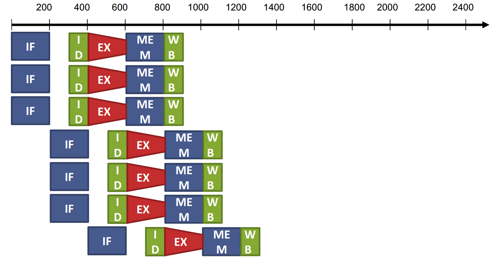
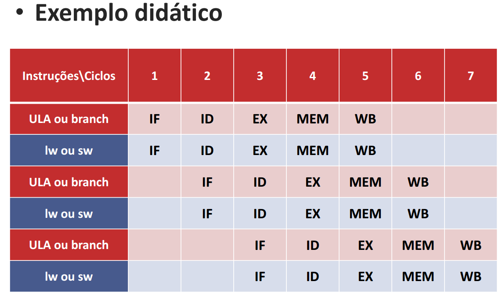

# Processadores com despacho múltiplo de instruções 

Como aumentar o desempenho além do pipeline? 

 

Lançar múltiplas instruções para a execução em paralelo 

Em 1 ciclo lançar 2 ou + instruções 

CPI < 1 

Aumentar a profundidade do pipeline para ter mais instruções em execução 

 

 • Resultado do despacho múltiplo 

CPI abaixo de 1! 

IPC: instruções por ciclo. 

IPC = 4 -> quatro instruções finalizadas por ciclo 