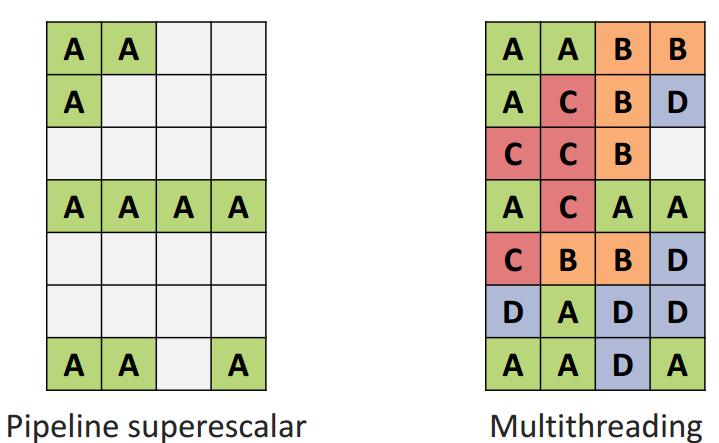
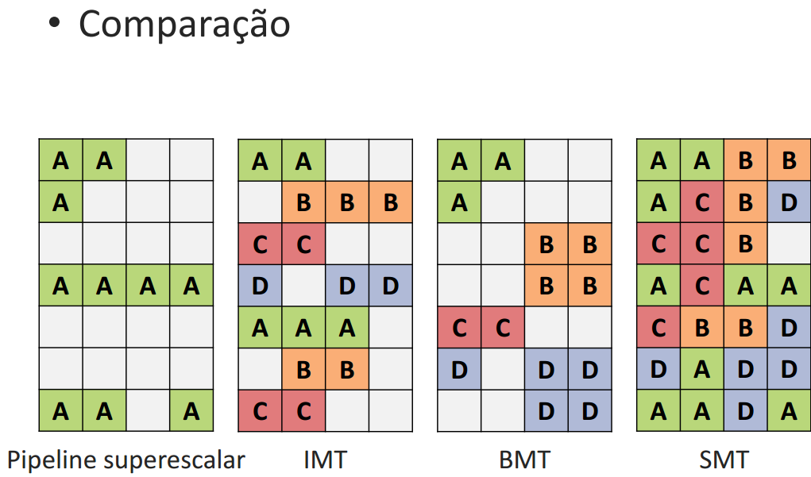
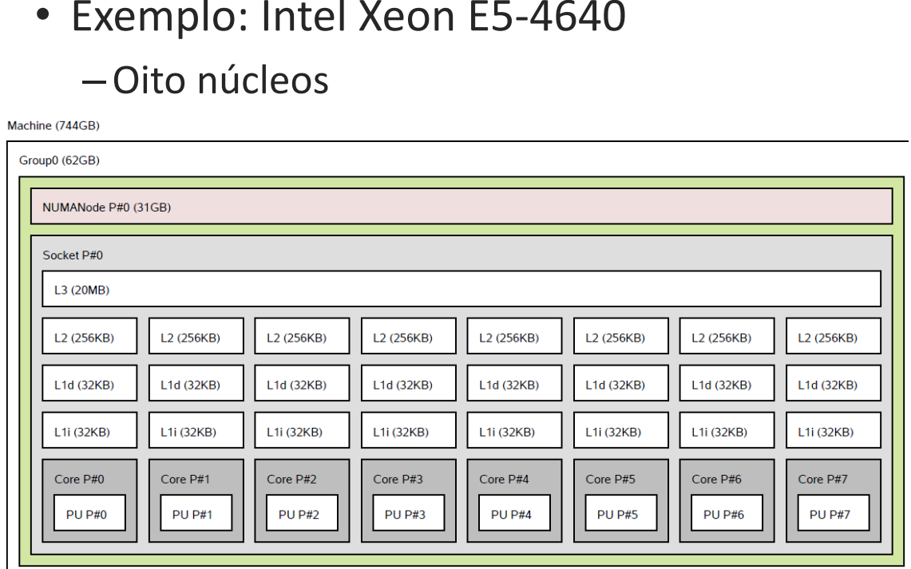
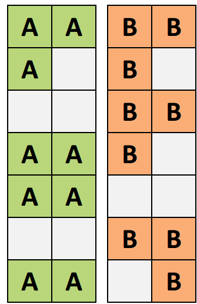
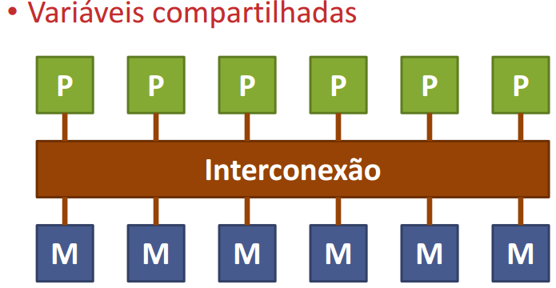
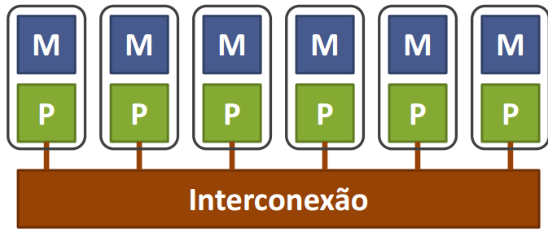
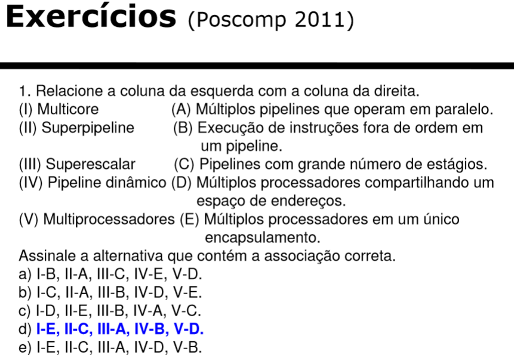

# Processadores multicore e multithread 

O que é thread? 

 

Ao efetuar o carregamento de um programa, o sistema operacional trabalha com processos. 

 

Cada software possui um processo (alguns utilizam árvores de processos). 

O processo é uma lista de instruções. 

A lista de instruções executadas são as threads (tarefa). 

Multithread 

 

Multithreading resulta em CPUs virtuais. 

 

Multithreading é a capacidade que o sistema  operacional possui de executar várias threads simultaneamente sem que uma interfira na outra. 

 

Instruções concorrem pelos recursos disponíveis: 

– Maior utilização do processador 

– Não aumenta desempenho sequencial! 

 

Exemplo de um fluxo de instruções executadas: 

 

"A" é uma lista de instruções (1 thread) 

Comparação

Multicores 

 

CPUs reais e independentes. 

 

Possuem datapaths e controles separados. 

 

Por que fazer multicores: 

O problema: Aumentos de frequência não eram mais possíveis 

A solução: Múltiplos processadores com menor frequência de relógio 

 

Ganho de desempenho paralelo (maior vazão) 

 

Ganho de desempenho ideal = nº de núcleos 

 

Podem compartilhar algum nível de memória cache. 

Lei de Amdahl 

 

 

Divide algoritmo em parte sequencial e paralela. 

            Tempo(n) = Tempo(1)*(B+(1/n)*(1-B)) 

Speedup: 

 

– Ganho de desempenho com paralelismo 

 

Speedup(n) = Tempo(1)/Tempo(n) 

Exemplo 1) Um programa executa em 10 segundos em um único núcleo e em 4 segundos usando quatro núcleos. Qual o speedup obtido? 

 

Resolução 

 

Speedup(n) = Tempo(1)/Tempo(n) 

 

Speedup(4) = 10 s / 4 s = 2,5 

 

 

 

Exemplo 2) O processo de abrir um filme em um computador leva 15 segundos. 70% desse tempo é gasto no disco. Se eu comprar um disco 2 vezes melhor, quanto tempo levará abrir um filme? 

 

Resolução 

 

Tempo(n) = Tempo(1)*(B+(1/n)*(1-B)) 

 

T = 15 s *(0,3 + (1/2)*0,7) = 15 s * 0,65 = 9,75 s 

 

 

Exemplo 3) Sua empresa desenvolve um simulador de tinta descolando da parede. A simulação sequencial leva 100 segundos. 95% do código é paralelizável. Quanto tempo levaria a aplicação executando em quatro núcleos? 

 

Resolução 

 

Tempo(n) = Tempo(1)*(B+(1/n)*(1-B)) 

 

• T(4) = T(1)*(0,05 + 0,95/4) 

• T(4) = 100*(0,05 + 0,95/4) = 5 + 95/4 = 5+23,75 

• T(4) = 28,75 s 

 

• Eficiência 

– O quanto é aproveitado da plataforma paralela 

 

Eficiência(n) = Speedup(n)/n
 

 

Número entre 0 e 1. 

Compartilhamento de memória: 

 

Memória pode ser: Compartilhada (UMA) vs Não compartilhada (NUMA) 

 

Multiprocessadores (UMA) 

 

– Todos os processadores acessam uma  memória compartilhada 

– (UMA) Uniform Memory Access 

– Memória centralizada 

– Acessos levam o mesmo tempo 

Multicomputadores(NUMA) 

 

– Cada processador endereça sua memória local 

– (NUMA) Nonuniform Memory Access 

– Memória distribuída 

– Tempo de acesso depende se memória local ou remota 

Exemplo 01) Duas opções de máquina para a empresa: 

• Máquina UMA com 4 núcleos - T(UMA) = 28,75 s 

• Máquina NUMA com 4 núcleos 

– Acesso à memória 3x mais rápido 

– Metade dos acessos à memória são remotos e têm latência 4x maior do que os acessos locais. 

40% do tempo de simulação é passado em acessos à memória. Qual a melhor opção? 

 

 

Resolução: 

 

 

T(NUMA) = 28,75*(0,6 + 0,4*(local+remoto)/3) 

local = 0,5 (50%), remoto = 0,5*4 (latência) 

 

T(NUMA) = 28,75*0,93 = 26,83 s 

 

 

 

MULTIPROCESSADORES 

 

Máquina com múltiplos processadores, mas também podem ser os multicores.

 