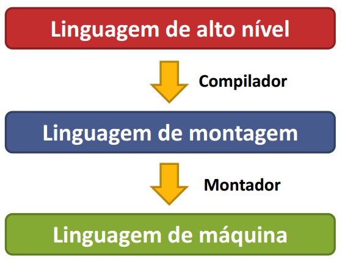
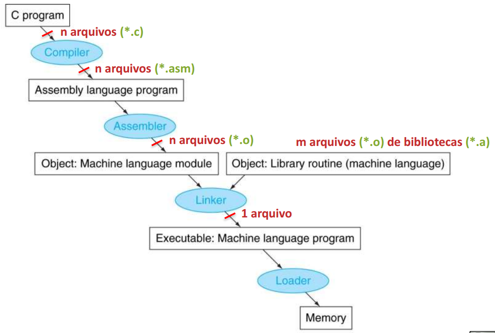
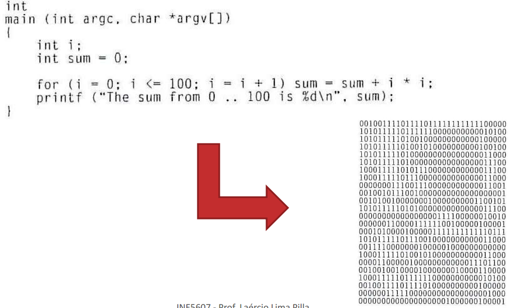
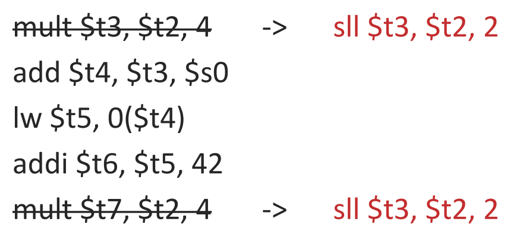
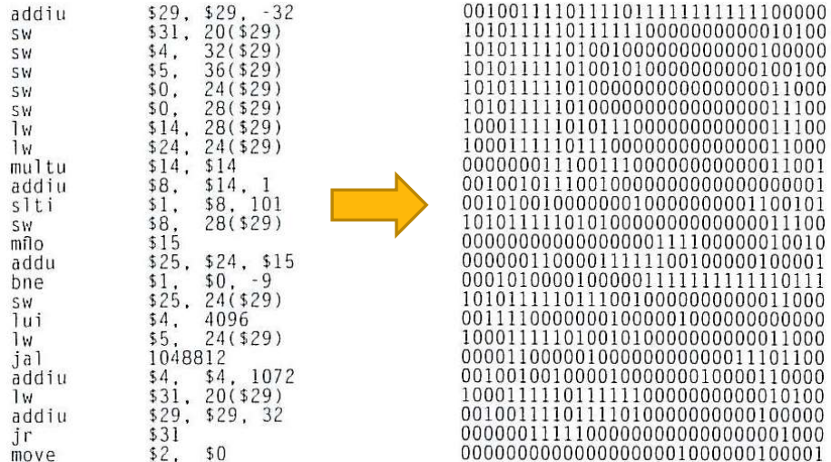
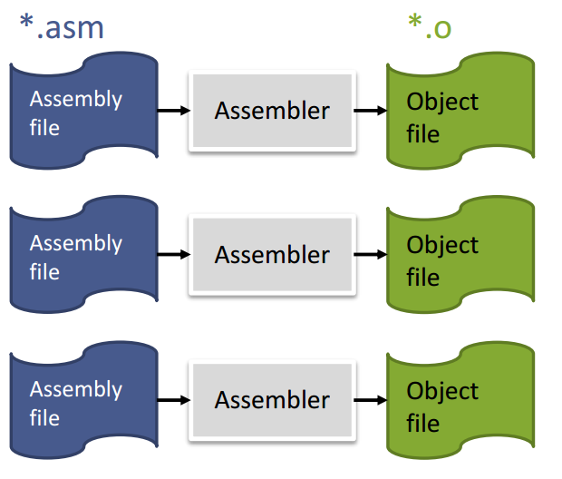
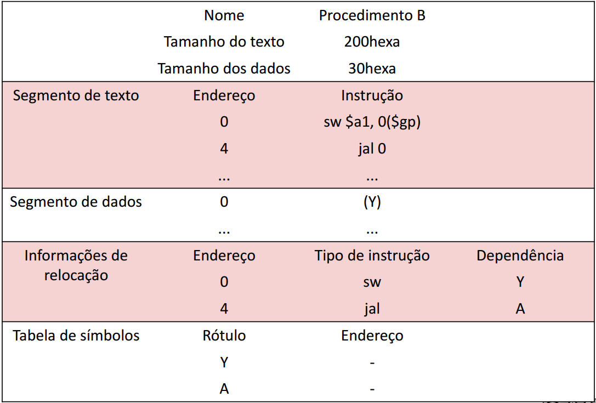
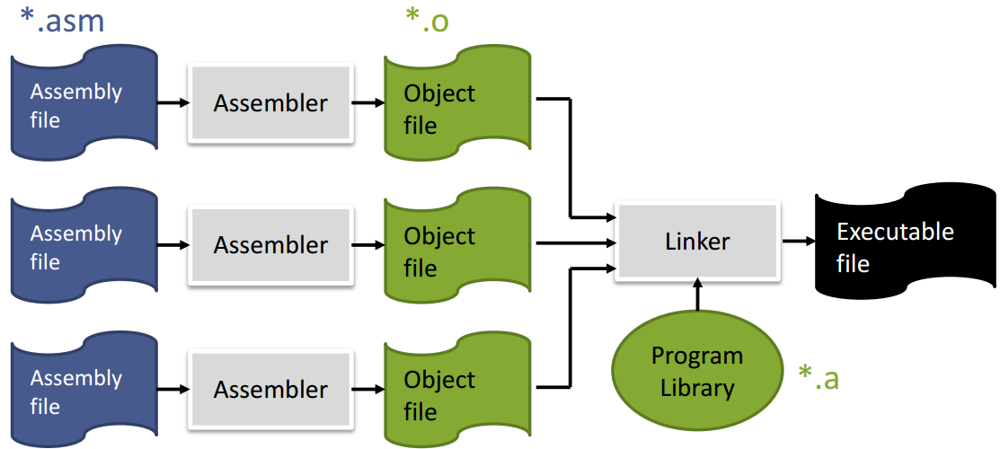
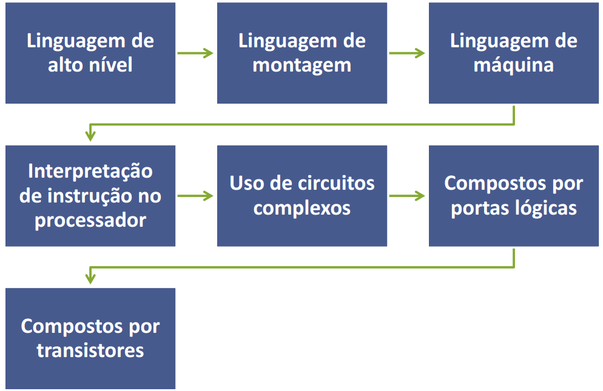

# Aula 13 - Tradução de programas 

 
 
 

## Compilador 
### Exemplo
Programa que soma os inteiros de 0 a 100 elevados ao quadrado. 

#### Funções 
- Transforma linguagem de alto nível para linguagem de montagem (assembly). 
- Redução de força - simplifica operações complexas 
- Remoção de variáveis não usadas 
- Remoção de operações cujas saídas não são utilizadas 
- Exemplo)

## Montador
### Exemplo

#### Funções 
- Traduz ou monta da linguagem de montagem para a linguagem máquina utilizando as psedoinstruções. Para isso o montador do MIPS utiliza o registrador $at. 
- O montador transforma o programa em assembly, que está divido em módulos, para um `arquivo objeto`. 

Cada arquivo objeto tem 6 partes: 
- Cabeçalho do arquivo - Tamanho e posição das partes do arquivo objeto 
- Linguagem maquina 
- Segmento de dados estatísticos - Variáveis globais 
- Informações de realocação - para o carregamento na memoria 
- Tabela de símbolos - são os rótulos 
- Informações de depuração - resumo de como foi a compilação 
- Psedoinstruções: 
  - simplificam o trabalho de escrever programas em assembly. 
  - `Move`, `mult`
- Módulos: 
  - Programas são divididos em módulos independentes. 
  - Dentro dos módulos há as referências(Labels).  

Exemplo 

## Linker 
- Gera arquivo executável a partir de arquivos objetos dos módulos e bibliotecas. 

Uma única mudança em uma linha de um programa exige compilação e a montagem do programa inteiro. A tradução completa é um desperdício terrível de recursos computacionais. Essa repetição é um desperdício principalmente para rotinas de bibliotecas padrão, pois os programadores estariam compilando e montando rotinas que nunca mudam. A solução para isso foi criar um programa que faz isso de modo independente, ou seja, remenda. 

### Funções 
- Organizar os módulos na memória 
- Resolver as referências não resolvidas  
- Determinar os endereços dos rótulos de dados e instruções 
- Remendar as referências do programa 
- Cria um arquivo-executável 
- Após a ligação, o programa está apto para rodar. 

### DLL's - dinamically linked libraries 
São os remendos dos programas, ou seja, vinculados a um programa na hora da execução. 
 
As DLLs exigem mais espaço para realizar a link-edição dinâmica, mas não exige que as bibliotecas inteiras sejam compiladas novamente. Na primeira execução ela executará mais trabalhos, mas depois somente fará desvios indiretos (jr).

#### Vantagens 
Não perde tanto tempo compilando as mesmas instruções 

#### Desvantagens 
Se uma nova versão da biblioteca for lançada para reparar erros, o programa link-editado estaticamente (DLL's) continua na versão antiga do programa. 
 
## Loader 
### Funções
Para iniciar o programa, o sistema operacional realiza diversas tarefas como: 
- Leitura do cabeçalho do arquivo para determinar o tamanho da memória necessária 
- Criação de um espaço de endereçamento para o programa 
- Copia instruções e dados para o espaço de endereçamento 
- Copia os argumentos passados ao programa para a sua pilha 
- Inicializa os registradores  
- Pula para o início do programa (main) 

## Esquema de tradução completo 

---

### Exercícios
1. Os principais elementos da linguagem de montagem são: 
 
operações, memórias, constantes, labels e diretivas. 
> f, operações, registradores, constantes, labels e diretivas. 

2. Para armazenar dados na pilha de um programa do MIPS é necessário ajustar a pilha para receber estes dados, subtraindo o número de palavras multiplicado por 4 do registrador $sp 
> v 

3. Na linguagem assembly as instruções têm uma representação simbólica denominada mnemônica e seus componentes são associados diretamente aos campos da instrução binária. 
> v 

4. Qual dos formatos de instrução abaixo não existem na arquitetura de conjunto de instruções do MIPS-32? 
> k e n 
>
> Existe a J, R e L 

5. Segundo convenções da linguagem MIPS, os seguintes pontos devem ser seguidos por um procedimento: 
- Os dois primeiros parâmetros de entrada de até 32 bits devem ser colocados nos registradores $v0, $v1. 
- Os quatro primeiros parâmetros de saída de até 32 bits devem ser retornados nos registradores $a0, $a1, $a2 e $a3. 
- Um procedimento não pode alterar os registradores de trabalho e nem o endereço de retorno ($ra). 
- Os valores dos registradores temporários não tem a obrigação de ser preservados durante a invocação de um procedimento. 
> f
>
> Os quatro primeiros parâmetros de entrada de até 32 bits devem ser colocados nos registradores $a0, $a1, $a2 e $a3. 
>
> Os dois primeiros parâmetros de saída de até 32 bits devem ser retornados nos registradores $v0 e $v1. 
>
> Um procedimento não pode alterar os registradores de trabalho e nem o endereço de retorno ($ra). 
>
> Os valores dos registradores temporários não tem a obrigação de ser preservados durante a invocação de um procedimento. 

6. A qual tipo de arquitetura de processador provavelmente pertence o trecho de código abaixo?  
 
Em máquinas CISC é mais provável que o conjunto de instruções tenha tamanho variável. Essa característica dificultaria a decodificação de instruções em máquinas RISC. 
> CISC
