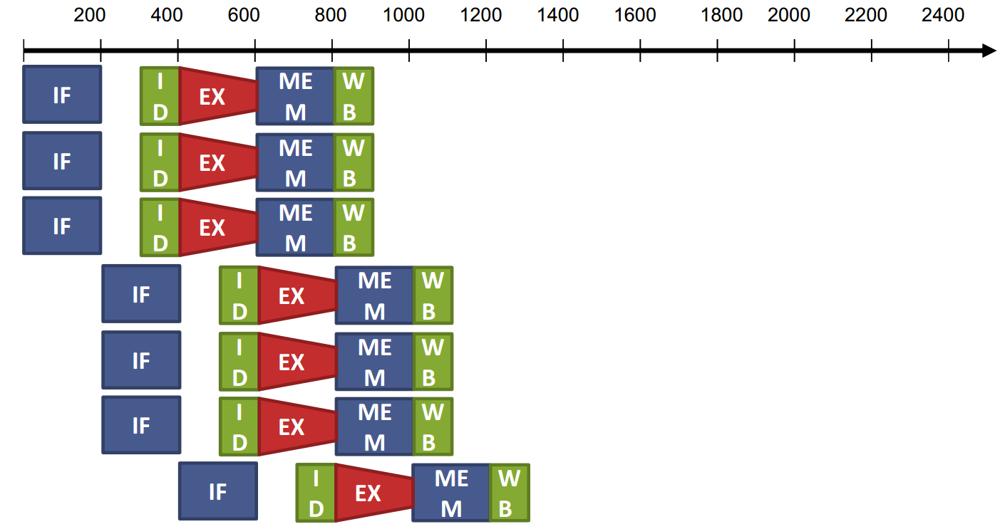
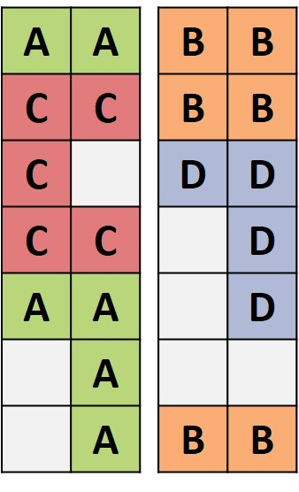
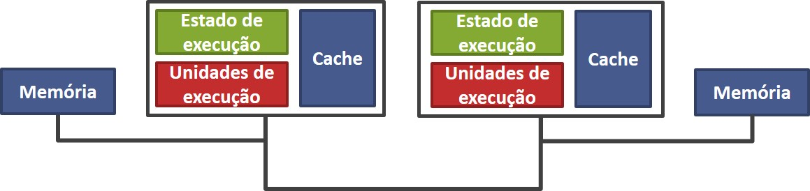
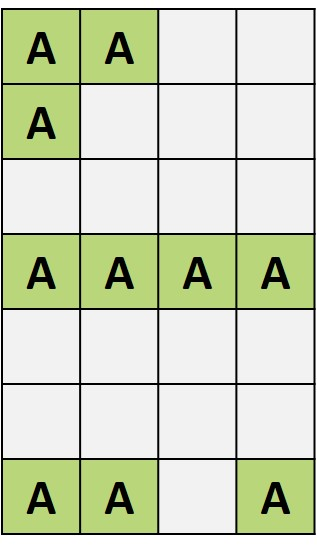
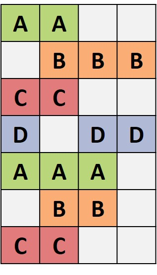

# Processadores com despacho múltiplo de instruções 
### Como aumentar o desempenho além do pipeline? 
- Lançar múltiplas instruções para a execução em paralelo 
- Em 1 ciclo lançar 2 ou + instruções 
- CPI < 1 
- Aumentar a profundidade do pipeline para ter mais instruções em execução 

 
 
 

-  Resultado do despacho múltiplo 
  - CPI abaixo de 1! 
  - IPC: instruções por ciclo. 
  - IPC = 4 -> quatro instruções finalizadas por ciclo 

## Multicore
#### Blocked Multithreading

#### Interleaved Multithreading

#### Simultaneous Multithreading

#### Superescalar

## Multiprocessador
#### Numa

#### Uma

## Superscalar
#### Superscalar

#### Multithread

