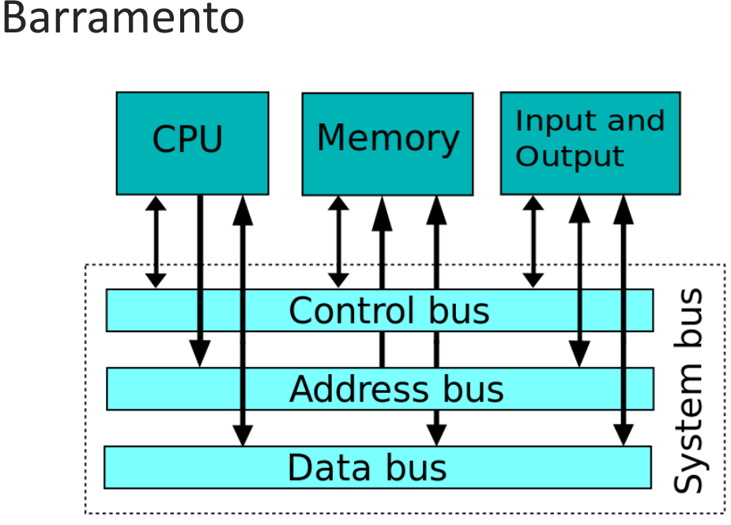
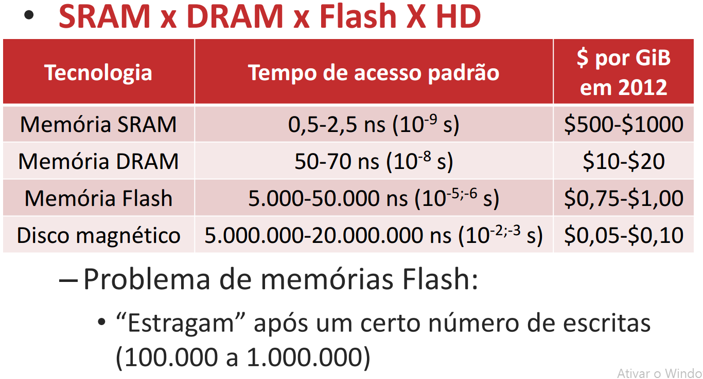
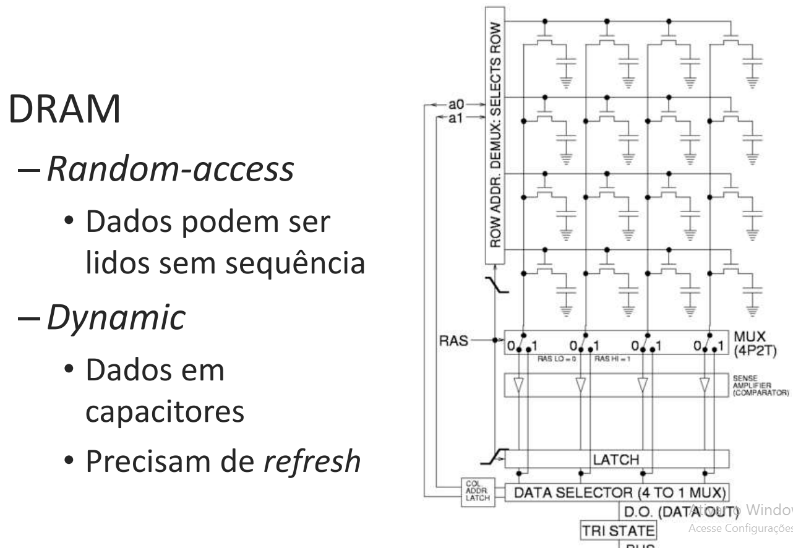

## Barramentos

---

## Tipos de computadores
1. Desktops 
2. Servidores
3. Embarcados
 
### Desktop 
- Para um único usuário
- O foco dos Desktops é o desempenho sequencial
- Executam SW independentes

### Servidores 
- O foco dos servidores é a vazão de dados
- Também são chamados de mainframes, minicomputadores ou supercomputadores
- Projetados para trabalhos específicos complexos ou para várias tarefas ao mesmo tempo
- Dão grande enfase a estabilidade, já que uma falha é mais prejudicial do que num desktop

### Embedded 
- Foco de computadores embarcados/embutidos são:  a especialização. 
- Tem baixo consumo de energia; 

---

## Memórias 
- Memória armazena dados
- Identificados por **endereços**
- Endereços apontam **words**
- Words possuem múltiplos **bytes**
 - 4 bytes para 32 bits, 8 bytes para 64 bits
- Words são grupos em **blocos**
 - Importante para caches
 
### Hierarquia de memória

### Static RAM (SRAM)
- Não representa uma memória não-volátil: SRAM ( Static Random Access Memory). 
- São os registradores 
- Não precisando que as células que armazenam os bits sejam atualizadas (de tempos em tempos) usualmente chamada de refreshing, como é o caso das memórias DRAM. 

#### Vantagens 
- A memória RAM estática é mais econômica, além de entregar mais performance. 

### Dynamic RAM (DRAM)

---

#### Author

Bruno Aurélio Rôzza de Moura Campos 

---

#### Copyright
 
